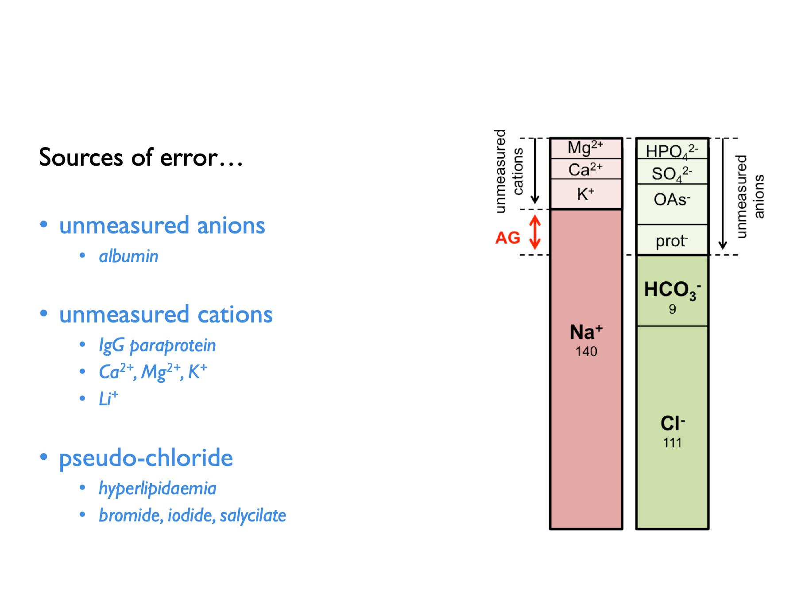

# Basic Concepts

This book does not aim to provide a comprehensive overview of fluid-electrolyte physiology. However, it will be useful to begin with a brief revision of a few key concepts.  

## Validity & assumptions {#validity}

All equations represent a model that has inherent assumptions.  These assumptions may or may not be explicitly stated alongside any given equation.  However, it is *always* worth considering what those assumptions might be.  For example, most equations (such as those used to estimate GFR from P~Cr~) assume that the body is a closed system in a state of equilibrium.  

Some equations, such as that used to calculate the TTKG \@ref(eq:TTKG) rely on a series of relatively complex assumptions (in this case concerning delivery of sodium to the distal tubule and the vasopressin status).  

Almost invariably these assumptions - whilst necessary to produce a simple mathematical model - are totally unreasonable from a biological standpoint.  Living organisms are not closed systems and never in a state of equilibrium.  So most of the time, the assumptions on which any given equation is predicated will have been violated.  This may not always be so serious a breach as to invalidate any result.  But one should always bear in mind that the validity of any result will often be compromised.  That is one of the main reasons *why* -- as discussed in the [introduction](#intro) and [disclaimer](#disc) -- the equations in this book should not be used in isolation to inform clinical decision-making.    

The major value of these equations is in their educational potential.  By understanding the models that they represent, one can better understand physiological principles.  The classic example here is the equation used to calculate the fractional excretion of sodium, FE~Na~ \@ref(eq:FENa).  THis equation can be a great way of understanding or explaining the filtration-reabsorption model of renal function and of how renal sodium and water handling can be perturbed in pre-renal *vs* intrinsic renal failure; however it's ability to differentiate pre-renal from intrinsic renal failure in the clinic is poor [@pahwa2016].  

## General principles

### Balance

For much of the time, we live in a state of fluid-electrolyte equilibrium - or "balance".  For any given substance (water, sodium, potassium etc.), the rate of excretion from the body matches rate of ingestion and therefore total body levels remain constant.  

Physiological perturbations can temporarily disrupt this equilibrium, causing a period of `"positive"` or `"negative"` balance.  For example, we might enter a period of positive potassium balance after switching from a low- to a high-K diet; we enter a period of negative potassium balance after vomiting.  We enter a period of positive sodium balance if we develop heart failure; we enter a period of negative sodium balance when we start diuretic therapy.  

Following any of these perturbations - if given enough time - we will enter a new state of equilibrium.  The patient starting on diuretics will enter a period of negative sodium balance (in which urinary losses exceed dietary intake) before eventually settling out in a new state of equilibrium in which losses again match intake, but at a lower total-body sodium.  

"Balance studies" in which the intake and losses are meticulously measured in humans or experimental animals are used by researchers investigating fluid-electrolyte balance.  (And in some cases, suprising results have lead to the discovery of new physiological processes - such as non-osmotic sodium storage [@titze2014]).  

When interpreting plasma / urinary electrolytes, it is always useful to consider whether the patient is likely to be in a state of neutral, positive or negative balance.  Some calculations assume neutral balance.  


### Testing during stress & "normal ranges"

During normal physiology, the renal excretion of most substances varies in proportion to dietary intake, in order to maintain balance.  Therefore the concept of a "normal range" for urinary electrolytes does not really apply in the same way as it does for plasma (in which electrolyte concentrations are maintained within a very tight range). 
Therefore it can be impossible to tell whether a value for U~Osm~, U~Na~, U~K~ etc. is normal or abnormal, without interpreting this in the clinical context.  

During periods of physiological stress however, urinary electrolytes can be interpreted with reference to the *expected* renal response to that stress.  For example, in water excess when the plasma is hypotonic, a normal kidney would be expected to produce a dilute urine (U~Osm~ < 100 mOsm) and if that is not observed then we can deduce that there is some impediment to renal water excretion.  For example, during potassium depletion we expect the kidney to conserve potassum (U~K~ \< 20 mM; TTKG \< 2) and if that is not observed then we can infer a renal cause for any hypokalaemia.  


### Renal clearance & fractional excretion

The renal `clearance` of a substance is the hypothetical volume of plasma from which that substance is removed by the kidneys, per unit time.  

```{block2, type='eqnpanel'}
\begin{equation}
  \text{clearance, }C_{X} = \frac{U_{X} \times V}{P_{X}}
  (\#eq:CLX)
\end{equation}
```

The clearance of a substance (such as inulin or creatinine) that is freely filtered by the glomerulus but neither secreted or reabsorped by the renal tubules will be the same as the glomerular filtration rate.  

The clearance of other substances can be compared to that of creatinine (or inulin) in order to make inferences about how they are handled by the renal tubules.  The `fractional excretion` of a substance is the proportion of the filtered load that is ultimately excreted in the urine.  The `tubular reabsorption` is the proportion of the filtered load that is re-absorbed by the renal tubules.  (These represent *net* excretion or re-absorption; many substances - such as K^+^ - are both secreted into and reabsorbed from the tubular fluid.)

```{block2, type='eqnpanel'}
\begin{equation}
  \text{fractional excretion, }FE_{X} = \frac{U_{X}}{P_{X}} \times \frac{P_{Creat}}{U_{Creat}}
  (\#eq:FEX)
\end{equation}
Note that for substances (such as Mg^2+^) that are heavily protein-bound in plasma, a correction factor is applied to account for the fact that not all of plasma X is availble to be filtered.  

\begin{equation}
  \text{tubular reabsorption, }TR_{X} = 1-FE_{X}
  (\#eq:TRX)
\end{equation}
    
```

### Tmax

The maximum transport capacity of the renal tubules for a given substance is termed the `T~max~`.  This concept is helpful when thinking about glucose and [phosphate](#TMPGFR) which will appear in the urine when the filtered load exceeds this threshold.  

### Osmolarity, osmolality & tonicity {#tonicity}

The `osmolarity` and `osmolality` of a solution express the concentration of osmoles (per unit volume or unit weight respectively).  

`Tonicity` expresses the ability of a solution to induce osmotic water shifts across a given semi-permable membrane.  This will be determined by the osmolarily (or osmolality) of the solution *and* the ability of its constituent osmoles to cross the semi-permeable membrane in question.  Substances that freely cross the membrane are known as `ineffective osmoles` - e.g. [urea for cell membranes](https://www.kidneyfish.net/post/tonic/).  Substances that do NOT freely cross the membrane are `effective osmoles` - e.g. glucose for cell membranes.  

### Gaps

Some substances cannot be measured directly in plasma or urine - either because we lack an accessible, reliable assay (e.g. as for urinary ammonium) or because we do not know what the substance is (e.g. following the ingestion of an unknown exogenous acid).  In this case, the presence of the substance can be inferred by calculating a `gap`.  

For example, the law of electroneutrality dictates that the concentration of cations and anions in solution must be equal.  The presence of an exogenous anion in the plasma will manifest as an apparent `anion gap` \@ref(eq:AGap).  Similarly, the presence of an exogenous osmole will manifest as an `osmolar gap` between measured and calculated osmolality \@ref(eq:Osmgap).  

There are a few potential sources of error when calculating anion gaps:  




