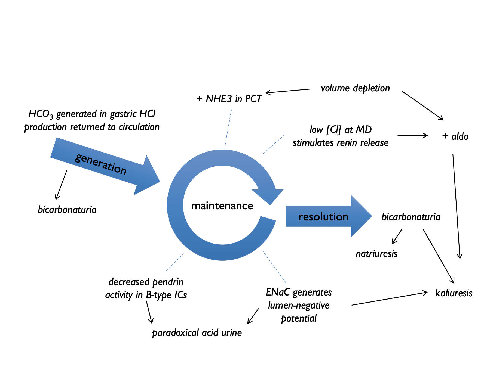

# General approach to a patient with electrolyte disturbance

In the following chapters, we will consider specific electrolyte or acid-base disorders.  However the clinical approaches to these very different disorders have much in common.  

For any disturbance in electrolyte or acid-base homeostasis it is usually worth starting with a few basic questions:

1) is there a history of vomiting, diarrhoea (or other gastrointestinal losses - e.g. biliary drains)?  

2) what is the current volume status / effective arterial blood volume (EABV)?  

3) are there any potential culprit drugs - including IV fluids?  

4) what is the diet?  

## Vomiting & diarrhoea {#vomit}

### Electrolyte content of GI fluids

+--------------------------+----------+----------+----------+-----------+
|fluid                     |Na (mM)   |K (mM)    |Cl (mM)   |HCO~3~ (mM)|
+==========================+==========+==========+==========+===========+
|vomit                     |60        |10        |120       |0          |
+--------------------------+----------+----------+----------+-----------+
|diarrhoea                 |75        |30        |60        |40         |
+--------------------------+----------+----------+----------+-----------+
|ileostomy fluid           |100       |10        |100       |30         |
+--------------------------+----------+----------+----------+-----------+
|bile                      |150       |6         |100       |40         |
+--------------------------+----------+----------+----------+-----------+
|pancreatic juice          |140       |5         |75        |140        |
+--------------------------+----------+----------+----------+-----------+

(from *FLUID THERAPY and disorders of electrolye balance*, WH Taylor, 1970 & [@gennari2008]).  

### Vomiting

The consequences of vomiting are reasonably complex.  Chloride loss leads to a metabolic alkalosis and the subsequent bicarbonaturia - and aldosterone secretion - lead to urinary losses of potassium (and to a lesser extent sodium) [@galla2000; @gennari2008; @luke2012a].  

In the `generation phase` of the metabolic alkalosis, gastric acid secretion (to compensate for losses in vomiting) is accompanied by secretion of HCO~3~ into the systemic circulation.  Initially this excess bicarbonate spills over into the urine, with the bicarbonaturia driving renal sodium and potassium loss.  

In the `maintenence phase`, several renal tubular processes act to sustain the metabolic alkalosis.  These are indicated by the numbers in the diagram below: 


1) volume depletion causes increased NHE3 activity  
2) low [Cl] at MD stimulates renin release (and hence aldosterone) - contributing to kaliuresis  
3) lack of distal tubular Cl limits Cl/HCO~3~ exchange by pendrin and hence stops HCO~3~ secretion by B-type intercalated cells  
4) lack of distal tubular Cl favours electrogenic Na^+^ exchange – hence H^+^ excretion and K^+^ excretion  

This results in a paradoxically acid urine and kaliuresis.  



Burton Rose described two phases of the renal response to vomiting:

+  early *(\< 3 days)* : pH \> 6.5, high Na, high K, low Cl, high HCO~3~ (*all high except chloride)*
+  late *(day 4+)* : pH \< 5.5, low Na, low K, low Cl, low HCO~3~ *(all low)*

Early after vomiting, metabolic alkalosis means that XS HCO~3~ is filtered, and the kidney cannot reabsorb this. Therefore bicarbonaturia drives natriuresis and kaliuresis (from increased distal Na delivery +/- volume contraction simulating aldosterone). By day 4, the kidney has upregulated ability to reabsorb HCO~3~, so natriuresis and kaliuresis abates, with paradoxically acid urine.  

### Quantitative assessment after vomiting

One entertaining exercise is to use the extent of any metabolic alkalosis to estimate the volume of vomitus [@kamel1990a].  The volume of distribution of bicarbonate approximates to total body water, TBW \@ref(eq:TBW) [@sabatini2009].  Therefore we can calculate:

```{block2, type='eqnpanel'}
\begin{equation}
  \text{mmoles of HCO3 loss} = TBW \times (P_{HCO_3} - 26)
  (\#eq:vomithco3)
\end{equation}
```

Then assuming that the net loss of gastric HCl (in mmoles) is equal to the net gain of bicarbonate (in mmoles) and that vomits contains \~100 mM HCl, we can calculate that:

```{block2, type='eqnpanel'}
\begin{equation}
  \text{volume of vomit (litres)} = \frac{\text{mmoles of HCO3 loss}}{100 \text{mmoles}} 
  (\#eq:vomitvol)
\end{equation}
```

This will of course under-estimate the true volume of vomit as it does not take into account bicarbonate loss in the urine.  


### Diarrhoea

The consequences of diarrhoea are more straightforward.  GI losses of bicarbonate and potassium tend to give rise to a metabolic (hyperchloraemic) acidosis and hypokalaemia [@gennari2008].  


## Drugs 

Many drugs can affect renal electrolyte handling.  Some will be obvious (e.g. renin-angiotensin system inhibitors and diuretics); some are less so.  It is worth paying particular attention to antimicrobial agents [@zietse2009], anti-virals, PPIs and chemotherapy.  Ask about drug exposure in the past; drugs such as cisplatin or lithium can cause changes in renal electrolyte handling that persist for many years.  


## IV fluids & electrolyte supplements

0.9% NaCl can induce a [hyperchloraemic acidosis](#HCMA).

Balanced crystalloids contain lactate, acetate or gluconate, which are metabolised to bicarbonate.  Plasmalyte-148 contains 27 mM acetate and 23 mM gluconate = 50 mM bicarbonate-equivalents.  


It can be helpful to consider electrolyte supplements in the context of normal dietary intake:  

```{r, echo=FALSE, message=FALSE, warning=FALSE}
df_solutes <- read.csv("tables/solutes.csv", header = TRUE)
knitr::kable(df_solutes)

```

NB the values (all mmoles) in the table above are very approximate; HCO3 refers to bicarbonate or bicarbonate-equivalents (i.e. substances that will be metabolised to bicarbonate).   

Citrate often preferred to HCO~3~ (either as NaHCO~3~ or in sando-K) for long-term supplementation in RTA for three reasons:  

i) because will correct hypocituria (and reduce stone risk);  
ii) will avoid a sodium load (in NaHCO~3~) which will increase UCa and increase stone risk;  
iii) bicarbonate can be poorly tolerated as it is converted to CO~2~ in the stomach, causing bloating.  

Conversion of citrate may be impaired in liver disease.    

<!--
### Electrolyte supplements

Bicarbonate:  

- 1.26% NaHCO~3~ is 150 mM  
- 8.4% NaHCO~3~ is 1M  
- 2g qds = 8g = \~ 100 mmol HCO~3~

Potassium:  

- Kcitrate, 10 ml contains \~ 12 mmol citrate (= 12 mmol HCO~3~ equivalent) and 30 mmol K  
- SandoK, 2tabs qds contains 100 mmol K^+^ + 64 mmol Cl^--^ + 32 mmol HCO~3~    -->


## Diet  

Meat-based diets generate acid.  H^+^ production is approximately 1mmol/kg body weight on an omnivorous diet.  A diet based on fruit and vegetables will generate a net alkali load [@kamel1990a].  


## Basic set of investigations

Ideally, investigations should be targeted to address a specific clinic question. However, electrolyte disorders can be confusing and there is not always time to think things through thoroughly at the time of initial assessment.  A general set of investigations that are useful in most circumstances are given in the box below.  Ideally these should be sent before any therapeutic manoeuvres that might alter the results (e.g. IV fluids).  

```{block2, type='algpanel'}
If in doubt, send the following samples and think about it later:  

1. **Blood** for:
    + U&Es  
    + HCO~3~ (sometimes called TCO~2~)  
    + Cl^--^  
    + glucose  
    + albumin  
    + osmolality  
&nbsp; 

2. A **spot urine sample** for:
    + Na^+^  
    + K^+^  
    + Cl^--^  
    + osmolality  
    + creatinine  

```


