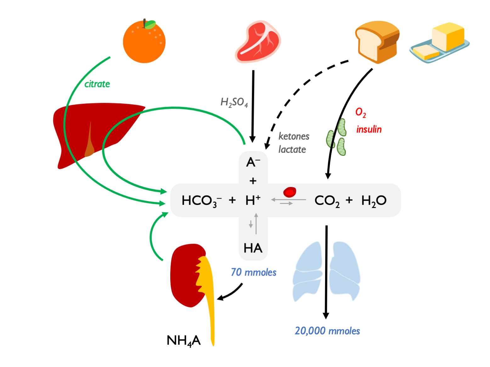
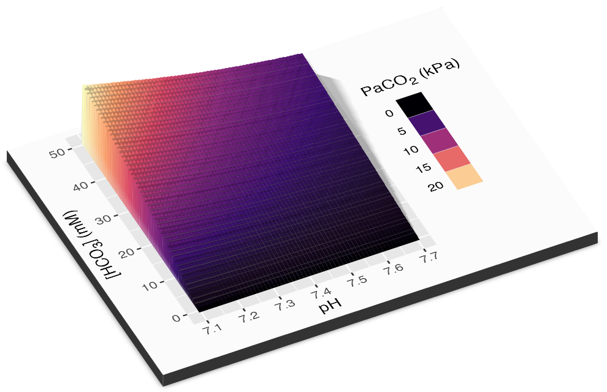
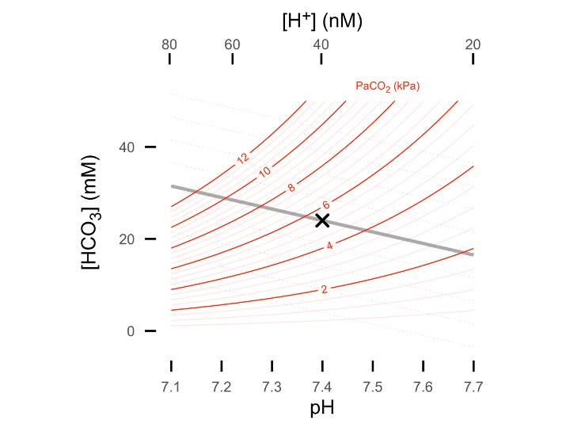
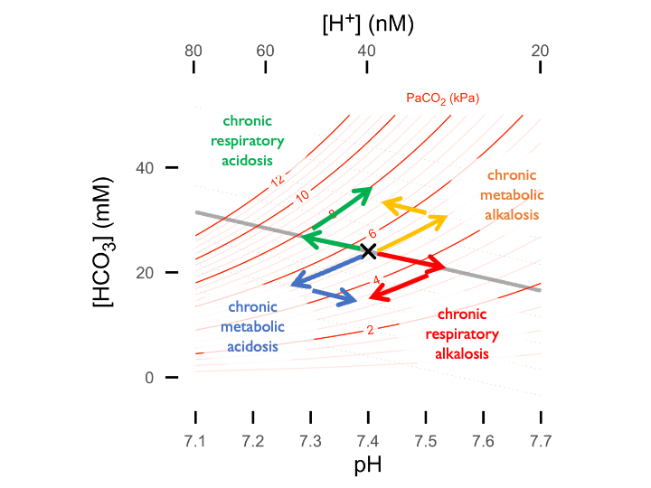
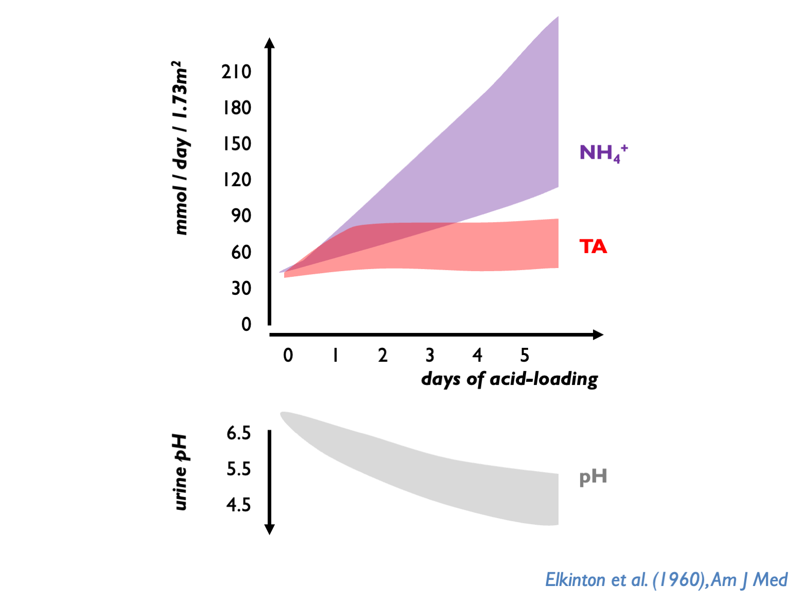
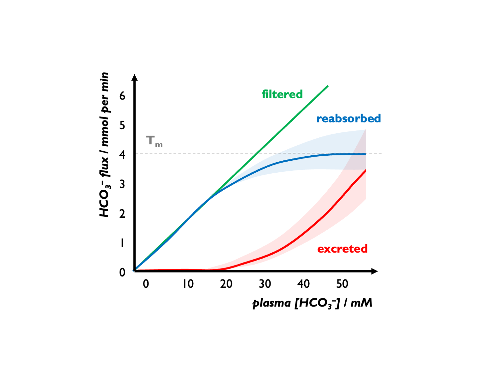

# (PART) Acid-base {-}

# Acid-base & chloride

## Acid-base homeostasis  

Summary of the dietary sources of acids and alkali and the role of the kidney in generating bicarbonate (to aid the excretion of non-volatile acid):



## pH

```{block2, type='eqnpanel'}
\begin{equation}
  pH=-log[H^{+}]
  (\#eq:pH1)
\end{equation}

\begin{equation}
  H^{+} = 10^{pH}
  (\#eq:pH2)
\end{equation}
    
```


## Adaptation

The relationship between pH, PaCO~2~ and HCO~3~ is described by the Henderson-Hasselbalch equation:  

```{block2, type='eqnpanel'}
\begin{equation}
  pH = pKa+log \frac{[A^-]}{[HA]}  
  (\#eq:HH1)
\end{equation}
    
\begin{equation}
  pH = 6.1 + log \frac{[HCO_3]}{\alpha .PaCO_2}  
  (\#eq:HH2)
\end{equation}

```

This relationship can be visualised in 3D...



...or 2D in the form of a Davenport plot (shown below) - or alternatively as a Siggard-Anderson plot (pH vs. PaCO~2~ with BE nomogram lines).  





Metabolic adaptation to respiratory alkalosis:  

+  acute (5 -- 10 mins) HCO~3~ 16 -- 18 mM *buffering by serum HCO~3~* 
+  chronic (2 -- 3 days) HCO~3~ 12 -- 15 mM *renal excretion of HCO3* 

Respiratory adaptation:  

+  for each mM HCO~3~ \< 25 PaCO~2~ should drop by... 0.16 kPa (1.2 mmHg) 
+  for each mM HCO~3~ \> 25 PaCO~2~ should rise by... 0.08 kPa (0.6 mmHg) 
+  Winter's formula: PaCO2 (mmHg) = (1.5 × HCO~3~) + 8 +/- 2 *(in metabolic acidosis)*  

<br>
<br>

## Renal control of acid-base homeostasis

Renal net acid excretion is determined by urinary titratable acid, ammonium and bicarbonate:  

```{block2, type='eqnpanel'}
\begin{equation}
  NAE = V \times (U_{NH_{4}^+} + U_{TA} - U_{HCO_{3}^-})  
  (\#eq:NAE)
\end{equation}

```

In the face of a daily acid load, the main job of the kidneys is to regenerate HCO~3~ for the ECF in order to replace that lost through buffering of non-volatile acids.  It does this through mechanisms that keep urine pH ~ 6 to minimise risks of uric acid precipitation (in acid urine) or calcium phosphate precipitation (alkaline urine).  

The three key processes are:  

i) reabsorption of filtered HCO3  
ii) excretion of titratable acid (H~2~PO~4~) = net HCO~3~ reabsorption  
ii) excretion of ammonium (glutamine > NH3 + H+ > NH~4~+) = net HCO~3~ reabsorption  

<br>
<br>

### Normal renal response to chronic acidosis

The normal response of the kidneys to chronic acidosis is to upregulate urinary NH~4~ excretion.  This was illustrated in historical acid-loading studies:



<br>

The preferential use of NH~4~ over TA is probably an evolutionary defense against kidney stones.  NH~4~ tends to keep upH around 6.0 - thus avoiding very acid urine (risk of uric acid precipitation) or very alkaline urine (risk ofCaHPO4 precipitation).  

Normally, kidney has to dispose ot 70 mmol non-volatile acid per day through TA and NH~4~.  uNH~4~ therefore normally 30 – 40 mmol per day; up to 100 - 200 mmol per day after acid-loading (Kamel & Halperin, KI Reports 2021; Uribarri, AJKD 2022).  uNH~4~ (directly-measured) higher on Western than plant-based diets (Uribarri AJKD 2022).  

<br>
<br>

### Citrate metabolism in acidosis  

In reponse to chronic acidosis, the proximal tubules also increase citrate reabsorption (with consequent hypocituria).  

[Hypocituria](https://www.ncbi.nlm.nih.gov/books/NBK564392/#:~:text=Etiology,%5D%5B20%5D%5B21%5D) is a common risk factor for urolithiasis.  (See also this [chapter](https://link.springer.com/rwe/10.1007/978-3-030-52719-8_111) and [review](https://www-nature-com.eux.idm.oclc.org/articles/s41581-023-00699-9).)

Citrate is present in diet: high in citrus fruits and coconut water.  Is filtered by glomeruli and reabsorbed in the PCT by the sodium-dicarboxylic acid cotransporter, NaDC1.  (Citric acid is of course a tricarboxylic acid.)  Metabolised in rpTEC mitochondria in citric acid cycle to make CO~2~ and H~2~O, generating bicarbonate (3 molecules HCO~3~ per 1 molecule of citrate).  (Analagous to citrte metabolism in the liver andmuscle.)  NaDC1 is upregulated in response to metabolic acidosis: presumably evolved as a defence against systemic acidosis by retaining alkali.  

Citrate is the most abundant urinary organic base and the most important chelator for urinary calcium.  Therefore hypocituria causes calcium oxalate / calcium phosphate stones.  

<br>

**Risk factors for hypocituria**:

- dietary (high meat / high Na / low fruit)  
- dRTA (due to systemic acidosis / hypoK)...  
- ...but not Fanconi pRTA (as cannot reabsorb filtered citrate)  
- chronic diarrhoea (due to metabolic acidosis / hypoK)
- chronic GI malabsorption / Roux-en-Y bypass
- hypokalaemia (see below)  
- topiramate (due to metabolic acidosis)  
- thiazides (due to hypoK)  

The effect of hypoK causing hypocituria explained as hypoK causing intercellular acidification of rpTECs, so [stimulating the Na-citrate co-transporter](https://pubmed-ncbi-nlm-nih-gov.eux.idm.oclc.org/1683169/).  

<br>

**Treatment of hypocituria**:

Can measure 24 hr citrate excretion or just treat empirically in most stone-formers:    

- dietary measures  
- K citrate supplements  

K citrate has been shown to reduce urinary calcium excretion in CaOx stone-formers (perhaps due to correction of acidosis / correction of hypoK / binding calcium in the gut).  

<br>
<br>

### Renal response to alkalosis

An alkalosis will correct automatically as HCO~3~- exceeds the Tm.  

There is an apparent Tm for HCO~3~-, set close to 25 mM but variable and influenced by various factors (GFR, luminal pH, hormonal factors etc.) For example, during volume depletion, stimulation of Na reabsorption (NHE activity) will increase HCO3- re-absorption, so leading to an increase in the apparent Tm for HCO3-. Under normal circumstances, FEHCO3 is \< 0.1% (Lote).



In alkalosis, bicarbonaturia can drive cation loss (e.g. hypokalaemia)
