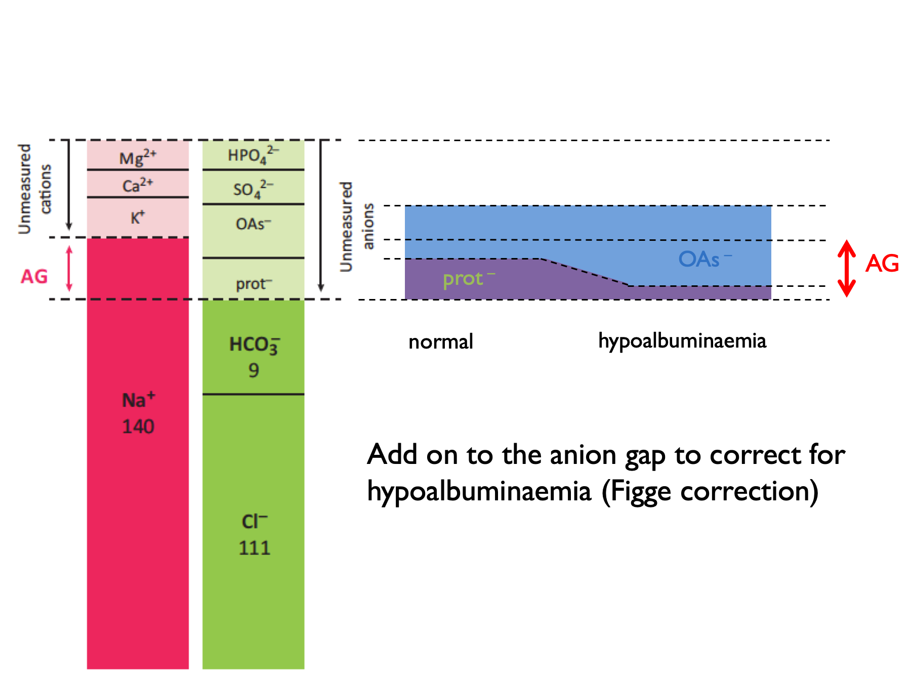
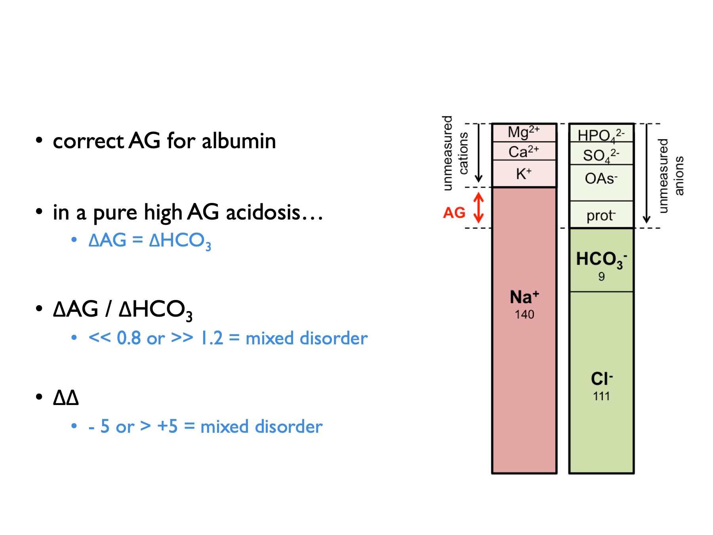
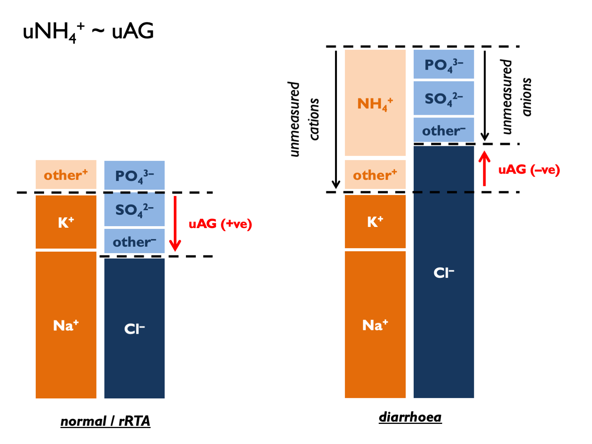
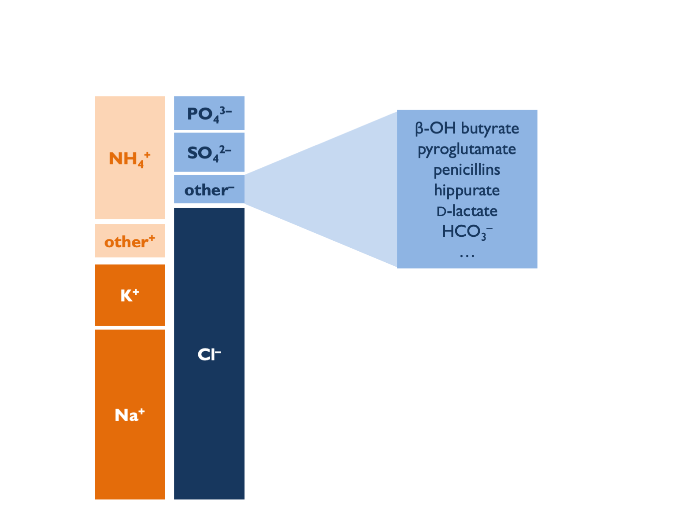
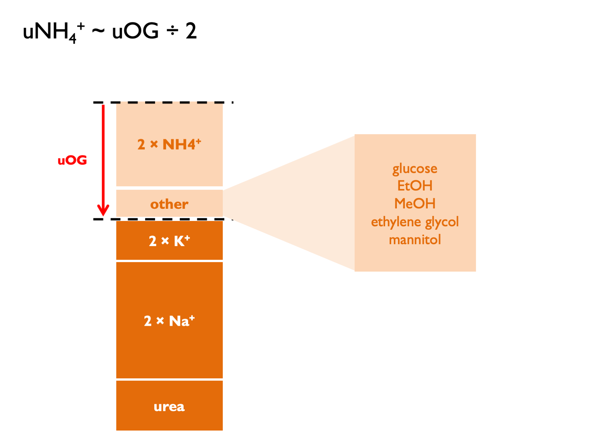

# Metabolic acidosis

## Serum anion & osmolar gaps

Metabolic acidoses are classified as `wide-anion-gap` (WGMA) or `normal-anion-gap` (= hyperchloraemic, HCMA).  In WGMA, the acidosis is caused by an exogenous acid present in plasma.  This is not measured directly, but will manifest as an apparent "anion gap".  

```{block2, type='eqnpanel'}
\begin{equation}
  \text{anion gap, } AG=P_{Na}-P_{HCO_{3}}-P_{Cl}
  (\#eq:AGap)
\end{equation}

NB some people also include P~K~ in the calculation.  
    
\begin{equation}
  \text{corrected anion gap, } cAG=AG+\frac{40-P_{albumin}}{4}
  (\#eq:cAGap)
\end{equation}
    
NB ADD ON to correct for hypoalbuminaemia.  
    
```



A normal AG is 12 ± 2 (or 16 ± 2 if include K^+^ in the calculation).  

'Deltas' are calculated by comparing to expected normal values (for AG or HCO~3~).  

```{block2, type='eqnpanel'}
\begin{equation}
  \text{delta anion gap, } \Delta AG=AG-12
  (\#eq:DelAGap)
\end{equation}

\begin{equation}
  \text{delta bicarbonate, } \Delta HCO_{3}=25-P_{HCO{3}}
  (\#eq:DelHCO)
\end{equation}

\begin{equation}
  \text{delta ratio, } =\frac{\Delta AG}{\Delta HCO_{3}}
  (\#eq:DelRatio)
\end{equation}

\begin{equation}
  \text{delta delta, } \Delta \Delta = \Delta AG - \Delta HCO_{3} \text{ (in ketoacidosis)}\\
  \text{delta delta, } \Delta \Delta = (0.6 \times \Delta AG) - \Delta HCO_{3} \text{ (in lactic acidosis)}\\
  (\#eq:deltadelta)
\end{equation}
```

The correction factor (0.6) applied when computing the delta in lactic acidosis is thought to be due to lower renal clearance of lactate (compared to ketone) anions [@berend2014].  

Normal range for delta ratio (ΔAG / ΔHCO~3~) is 1 -- 2.  

Therefore to interpret delta ratios:  



The `osmolar gap` is used to identify exogenous or un-measured osmoles in the plasma (which may be present in a subset of WGMA in which the acid is osmotically active): 

```{block2, type='eqnpanel'}
\begin{equation}
  \text{calculated osmolality, } cP_{Osm} =(2\times P_{Na})+P_{urea}+P_{glucose}
  (\#eq:calcOsm)
\end{equation}

\begin{equation}
  \text{osmolar gap, } OG = \text{measured } P_{Osm} - cP_{Osm}
  (\#eq:Osmgap)
\end{equation}
```

<br>
<br>

## Investigations in HCMA {#IxHCMA}

### Urine pH

Urine pH useful but there are some important practical considerations and potential for error in interpretation.  

- upH > 5.5 (uAG +ve) = dRTA 
- upH < 5.5 (uAG -ve) = pRTA or diarrhoea 

<br>
<br>

Pitfalls with urine pH (see supplement for [ESPN clinical practice points, NDT 2021](https://doi: 10.1093/ndt/gfab171)):  

- sample should be fresh and tested without delay (else risks of CO2 diffusion and urea-splitting organisms)  
- a pH meter is more accurate than dipstick (but does this matter? - see below)  
- uNa should be > 10 mM (else lack of distal tubular Na can induced a functional dRTA due to loss of negative tubular potential gradient)  
- obviously may be alkaline in context of urinary diversion  

Theoretically, delayed testing could cause an artificially high pH (i.e. false +ve RTA diagnosis) as CO2 diffuses out of urine to drop both urinary H+ and HCO3. However, a [nice study](https://pubmed.ncbi.nlm.nih.gov/22700881/) showed that actually the risk of diagnostic error in dRTA from CO2 diffusion is probably quite low.  Tested effect of mixing urine samples with air (n = 100).  Exposure to air reduces urine pCO2 and HCO3 by 66 -- 75%.  CO2 diffusion out of urine samples occurs in first 5 minutes, with no subsequent change out to 50 mins.  This does tend to raise pH - but effect is only small (c. 0.1 pH unit) and particularly so if urine pH < 5.5 to begin with.  Therefore the historical practice of collecting under mineral oil is unnecessary.  

An apparent inability to acidify urine has been reported in some patients with chronic diarrhoea (Batlle, NEJM 1998; Palmer & Clegg, CJASN 2019).  This is attributed either to UNa < 10 mM (Batlle, NEJM 1998; ESPN / ERKnet dRTA guidelines supplement) and / or to high levels of ammonium in the urine raising pH – particularly if stimulated by hypoK (https://www.uptodate.com/contents/urine-anion-and-osmolal-gaps-in-metabolic-acidosis).  Therefore, interpret upH in the context of uNA and uAG.  

<br>

Concordance between urine dipstick and pH meter result is [not brilliant but not terrible](https://pubmed.ncbi.nlm.nih.gov/23435644/).  For many patients it will be good enough to decide whether confidently above or below 5.5 - but caution if dipstick pH < 6.0.  

<br>
<br>

### Urine anion gap, osmolar gap, ammonium

Historically, it has been technically difficult to measure urinary ammonium.  Therefore the *urinary* anion gap has been used as a proxy measure - either in isolation or in combination with the urinary osmolar gap [@kraut2012; @sharma2015]: 

```{block2, type='eqnpanel'}
\begin{equation}
  \text{urinary anion gap, } UAG=U_{Na}+U_{K}-U_{Cl}
  (\#eq:urineAGap)
\end{equation}

\begin{equation}
  \text{calculated urinary osmolality, } cU_{Osm} = 2 \times (U_{Na}+U_{K})+U_{urea}+U_{glucose}
  (\#eq:calcUOsm)
\end{equation}

\begin{equation}
  \text{urinary osmolar gap, } UOG=\text{measured } U_{Osm} - cU_{Osm}
  (\#eq:UOsGap)
\end{equation}

\begin{equation}
  \text{urinary cations, } U_{cations}=\frac{U_{Osm}-U_{urea}-U_{glucose}}{2}
  (\#eq:UCat)
\end{equation}

\begin{equation}
  \text{calculated urinary ammonium, } cU_{NH_{4}}\approx UAG \approx \frac{UOG}{2} \approx U_{cations}-(U_{Na}+U_{K})
  (\#eq:UCalcNH)
\end{equation}
```


UAG normal range is positive 30 -- 50.  

Classical interpretation of uAG:

- normally+ve  30 –- 90 (dietary absorption of Na and K exceed that of Cl – and this has become more +ve in recent decades as diet has changed)  
- if zero, then NH~4~ excretion around 80 mmol per day (Kamel & Halperin, KI Reports 2021)... ...therefore +50 = 30 mmol per day  
- in context of HCMA: under –ve 20 = lots of NH4 (>100 mM) = appropriate = diarrhoea (“neg-GUT-tive”)  
- in context of HCMA: over +ve 20 = inappropriately low NH4 (<60 mM) = RTA  
- and +/- 20 hard to interpret with confidence (UpToDate)  

<br>
<br>

However, this may be largely nonsense for several reasons.  The main criticism is that in steady state, uNa, K and Cl must reflect intake (argued eloquently by Uribarri, JASN 2021).  There is therefore a heavy dependence on diet (normal uAG from +40 to +70 since 1980s = more dietary K with organic anions – Uribarri JASN 2021).  The correlation between uAG and directly-measured NH~4~ in (non-acidaemic) subjects is terrible (Ubarri, AJKD 2022).  

<br>

uAG is also subject to errors from:

- other unmeasured anions – tend to give +ve AG (Batlle, CJASN 2018)...  
- ...including bicarbonaturia in pRTA on supplements or with urinary diversion and if upH > 6.5 then likely bicarbonaturia, so expect obligate +ve uAG in metabolic alkalosis   
- unmeasured cations (e.g. Li+) = tend to give –ve AG  
- a dependance on upH (Uribarri JASN 2021);  at upH = 7: uHCO~3~ = 10 mM and significant increase in divalent uPO~4~ – so tend to +ve AG…  
- impaired ammoniagenesis in AKI or CKD (from decreased PCT mass, hyperK, RAAS blockade and lower aldo)  
- extreme volume depletion (uNa < 10 mM prevents acidification)  
- irrelevant extra-renal ammoniagenesis with urea-splitting organisms  

Some unmeasured aniones - e.g. β-hydroxybutyrate / acetoacetone - might be detected with an uOG.


<br>

So how do we reconcile all of these concerns with the historical data showing diagnostic utility in dRTA vs. diarrhoea?  Most likely that uAG is a bad measure of uNH~4~ but could differentiate between RTA and diarrhoea for other reasons.  In dRTA, uAG is positive if samples taken when patients in negative K balance: high uK will tend to +ve uAG whilst hypokalaemia will impair ammoniagenesis and raise upH.  In diarrhoea, uAG is negative because there is preferential loss of Na and K over Cl - hence relatively lower body Na + K, then reflected in urinary excretion.  In NH4Cl infusion, Cl is delivered without Na or K, leading to high uCl and -ve AG.  

<br>
<br>

The urinary osmolar gap should have fewer limitations than uAG:  


The theoretical concerns about invalid reasoning violating balance principles don't apply.  Still subject to errors from unmeasured osmoles and urea-splitting organisms.  Correlation with uNH~4~ very good in some studies (Fujimaru, Nephron 2021) and terrible in others (Raphael, CJASN 2019).  

<br>

Interpretation of [uOG](https://www.uptodate.com/contents/urine-anion-and-osmolal-gaps-in-metabolic-acidosis):  

- normal: 10 – 90 (= 5 – 45 mM NH4)  
- in context of HCMA: uOG > 400 = 200 mM NH4 = appropriate response = diarrhoea  
- in context of HCMA: uOG < 150 = 75 mM NH4 = inadequate response = dRTA  
- ...or for a more complex interpretation see Kamel & Halperin (KI Reports, 2021): multiply uNH4/uCr by estimated Cr excretion rate and deem >50 mmol NH4 per day an adequate response to acidosis.  

<br>
<br>

## Causes of a metabolic acidosis

### Approach to metabolic acidosis


```{block2, type='algpanel'}
Order of investigations in metabolic acidosis:  

1)  cAG -- is this a normal or wide gap acidosis?
2)  ΔAG vs ΔHCO~3~ in WGMA -- is rise in AG proportional to fall in HCO~3~ (or is this a mixed metabolic disorder)?  
3)  PaCO~2~ -- is the fall in PaCO~2~ proportional to the fall in HCO~3~ (0.16 kPa per mM)?  
4)  +/- OG for a WGMA  
5)  +/- upH, uAG, uOG for HCMA  
6)  +/- FEHCO~3~ for HCMA with --ve UAG (but easier to first look for Fanconi syndrome)  

ΔAG / ΔHCO~3~ \< 1 mixed WGMA / HCMA or urinary ketone losses (DKA)
ΔAG / ΔHCO~3~ \> 2 mixed WGMA and metabolic alkalosis
  
```


#### WGMA

Differential diagnosis of a wide-gap metabolic acidosis:  

<!-- +  **G** \* glycols *ethylene glycol; propylene glycol* -->
<!-- +  **O** oxoproline -->
<!-- +  **L** L-lactate *shock, liver disease, metformin, linezolid (several weeks into Rx)* -->
<!-- +  **D** D-lactate *short bowel syndromes* -->
<!-- +  **M** \* methanol -->
<!-- +  **A** aspirin -->
<!-- +  **R** renal failure -->
<!-- +  **K** \*^?^ ketoacidosis -->

```{r, echo=FALSE, message=FALSE, warning=FALSE}
source('~/OneDrive - University of Edinburgh/R files/R Scripts/Markdown_tables.R')
df_table <- read.csv("tables/WGMA.csv", header = FALSE)

df_table %>% table_2cols()

```

Propylene glycol (a solvent for parenteral medications: lorazepam, diazepam, phenobarbital) is metabolised to L- and D-lactate.

\* WGMA with elevated OG = EtOH ketoacidosis, MeOH and the glycols. The OG is NOT elevated with salicylates. There is a time-dependant conversion from OG to AG following ingestion of toxic alcohol (EG > glycolic acid > oxalate). 

NB Ethylene glycol = high lactate (false +ve) on ABG machine but not formal lab assay.  Administer fomepizole early (before significant acidosis). Indications for RRT (prefer HD to HF): acidosis, renal failure, EG level \> 50 mg/L.  


#### HCMA (normal gap) {#HCMA}

The approach to HCMA has been extensively reviewed [@rodriguezsoriano2002; @kraut2012; @haque2012; @sharma2015).  

The causes can be classified using the urinary anion gap \@ref(eq:urineAGap) and the fractional excretion of bicarbonate \@ref(eq:FEHCO3):  

<!-- +  \+ ve U AG (unable to acidify urine) -->
<!--     +  *RTA type I (always)* -->
<!--     +  *RTA type IV (always)* -->
<!--     +  *RTA type II (sometimes) \** -->

<!-- +  -- ve U AG (able to acidify urine)   -->
<!--     +  renal (FEHCO~3~ \> 10 -- 15 %) -->
<!--         +  *RTA type II (sometimes) \** -->
<!--         +  *RTA of renal insufficiency (GFR \> 15)* -->

<!--     +  extrarenal (FEHCO~3~ \<\< 5 % \*\*)   -->
<!--         +  *diarrhoea (GI HCO~3~ loss)* -->
<!--         +  *ureteric diversion* -->
<!--         +  *pancreatic secretions* -->
<!--         +  *biliary secretions* -->

```{r, echo=FALSE, message=FALSE, warning=FALSE}
source('~/OneDrive - University of Edinburgh/R files/R Scripts/Markdown_tables.R')
df_table <- read.csv("tables/HCMA.csv", header = FALSE)

df_table %>% table_3cols(caps = T)

```

\* The UAG is positive in all distal RTA. It may be positive or negative in proximal RTA.

\*\* FEHCO~3~ also \< 5 % in dRTA.  

```{block2, type='eqnpanel'}
\begin{equation}
  FE_{HCO_{3}} = \frac{U_{HCO_{3}}}{P_{HCO_{3}}} \times \frac{P_{Creat}}{U_{Creat}}
  (\#eq:FEHCO3)
\end{equation}
    
```

Hyperchloraemic acidosis may also be caused by iatrogenic `chloride excess`.  This may be particularly pronounced when IV NaCl is used to replace losses of urinary anions that represent a store of "potential bicarbonate" - e.g. ketone bodies or D-lactate [@sabatini2009].

Historically, TPN was a cause of "hyperalimentation acidosis" (as cationic amino acids were metabolised to sulphuric acid) - but contemporary formulations contain a source of potential bicarbonate (e.g. acetate) to offset this.  

HCMA in the context of urinary diverstion occurs because colonic epithelium (used to construct neo-bladder) contains a Cl/HCO~3~ exchanger.  Therefore chloride-rich urine promotes massive HCO3~3~ secretion.  Colonic epithelium is also permeable to NH~3~ so that bacterial urease activity can cause hyperammonaemic encephalopathy.  

