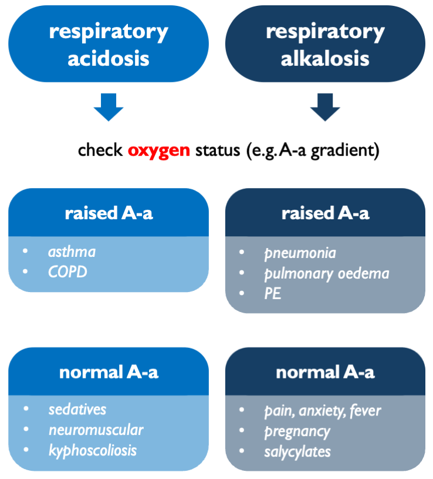

# Respiratory acid-base disorders

## Classification of respiratory acid-base disorders

The main step in classifying respiratory acid-base disorders is to work out whether they are arising in the lung or centrally (i.e. neural control of breathing).  Formally, that can be assessed by checking the A-a gradient.  In practice, that is usually determined by clinical gestalt: e.g. is the SaO2 appropriate for the FiO2?  

In **respiratory acidosis**:  

- high A-a gradient = impaired gas transfer (V/Q mismatch, diffusion impairment, shunt...)  
- normal A-a gradient = pure hypoventilation (CNS depression, obesity, neuromuscular...)  

In **respiratory alkalosis**:  

- high A-a gradient = hypoxia-driven hyperventilation (PE, pneumonia...)  
- normal A-a gradient = central hyperventilation (anxiety, salicylates...)  

<br>



<br>

## A-a gradient

The A-a gradient is the difference between the partial pressure of O~2~ in the alveloi, PAO~2~ (calculated) and in arterial blood, PaO~2~ (measured).   

```{block2, type='eqnpanel'}
\begin{equation}
 \text{A-a gradient}=PAO_2-PaO_2
  (\#eq:A-a)
\end{equation}

```

<br>

### Alveolar gas equation

PAO~2~ is calculated using the alveolar gas equation:  

```{block2, type='eqnpanel'}
\begin{equation}
 PAO_2=FiO_2(P_{atm}-P_{H_2O})-\frac{PaCO_2}{R}
  (\#eq:PAO2)
\end{equation}

```

For patients breathing room air at sea level and on a balanced diet, this can be approximated as:  

```{block2, type='eqnpanel'}
\begin{equation}
 PAO_2 (\text{in kPa}) \approx 20-\frac{PaCO_2}{0.8} 
  (\#eq:PAO2approx)
\end{equation}
    
assuming:  

 - FiO$_2$ $\approx$ 0.21 
 - P$_{atm}$ $\approx$ 101 kPa 
 - P$_{H_2O}$ $\approx$ 6.3 kPa 
 - R $\approx$ 0.8

...and to convert from kPa to mmHg, multiply by 7.5  

```

<br>

### Explanation 

The partial pressure of oxygen in the alveoli will be determined by the maximum available O~2~ (FiO~2~ $\times$ P$_{atm}$) minus 'space' occupied by water vapour (as per Dalton's law or partial pressures) and minus O~2~ consumed by metabolism.

So, $PAO_2 = \text{inspired } O_2 - O_2 \text{ lost to metabolism}$.  

Metabolic O~2~ consumption is inferred from CO~2~ production, i.e. PaCO~2~.  CO~2~ production is less than O~2~ consumption.  This discrepancy is described by the respiratory quotient, $R = \frac{\dot{V}CO_2}{\dot{V}O_2}$.  Typically, R ~ 0.8, meaning that for every 10 O~2~ molecules consumed, 8 CO~2~ molecules are produced.  Therefore, $O_2 \text{ lost to metabolism} \approx \frac{PaCO_2}{R}$.  

R varies with metabolic fuel:  

- CHO: R = 1.0  
- fat: R = 0.7  
- protein: R $\approx$ 0.8

So:  

- most patients on a mixed diet, R $\approx$ 0.8  
- fasting / ketotic, R closer to 0.7  
- getting TPN on ITU, R closer to 1.0     

<br>

### Interpretation

```{block2, type='eqnpanel'}
\begin{equation}
 \text{A-a expected (kPa)} \approx \frac{\text{age}}{30}+0.5
  (\#eq:Aaexpected)
\end{equation}

```

So normal A-a gradient is very approximately:  

- 1-2 kPa in young adults  
- 2-3 kPa in middle age  
- 3 kPa in elderly  

Interpretation is best validated for patients on room air.  Once on supplemental O~2~, the gradient becomes larger and is harder to interpret.  