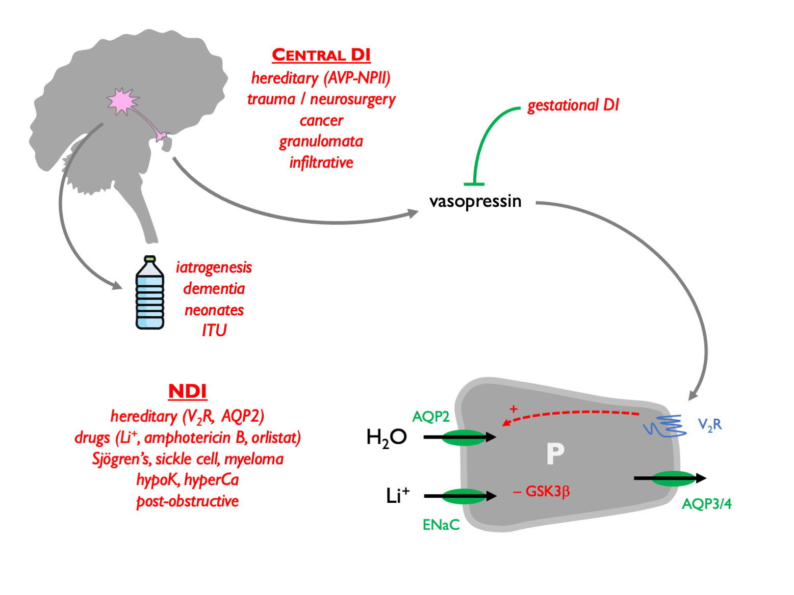
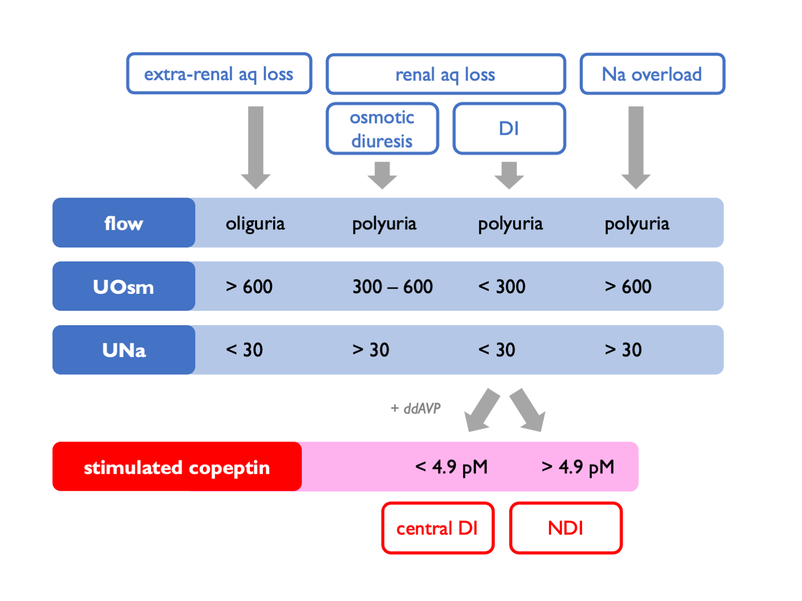

# Hypernatraemia

## Causes of hypernatraemia    

In contrast to hyponatraemia, which may pose a diagnostic conundrum, in hypernatraemia it is almost always easy to work out the underlying cause.  Hypernatraemia is caused by loss of free water (dehydration) or gain of Na.  

```{r echo = FALSE, message = FALSE}

library(magrittr)

NA_sub_x <- function(df, x) {
  df[is.na(df)] <- x
  return(df)
}

df <- readr::read_csv("tables/hyperNa.csv", show_col_types = FALSE)
df %>% NA_sub_x(' ') %>% knitr::kable(align = rep('c',4)) 

```

Because the thirst resoponse is such a powerful negative feedback controlled of P~Osm~, in most cases hypernatraemia arises through *lack of access to water* rather than excessive water losses *per se*.  This is often iatrogenic: a classic example being the patient with chronic diabetes insipidus who, having been used to drinking many litres of water per day, becomes hypernatraemic when they are admitted to hospital and their access to water is limited.  

Differential diagnosis of hypernatraemia due to free water deficiency:  



## Diagnosis in hypernatraemia



## Treatment of hypernatraemia  

The treatment of hypernatraemia is simple: give more free water (either enterally or as intravenous 5% glucose).  The total body water deficit can be estimated as follows (where total body water, TBW is given by \@ref(eq:TBW)):

```{block2, type='eqnpanel'}

\begin{equation}
  \text{water excess } = TBW \times (1-\frac{P_{Na}}{140})
  (\#eq:aqxs)
\end{equation}

\begin{equation}
  \text{water defecit } = TBW \times (\frac{P_{Na}}{140}-1)\approx \frac{P_{Na}-140}{3}
  (\#eq:aqdef)
\end{equation}

```

Armed with this estimate, fluid may be prescribed at an appropriate rate to achieve gradual restoration of normal plasma tonicity.  