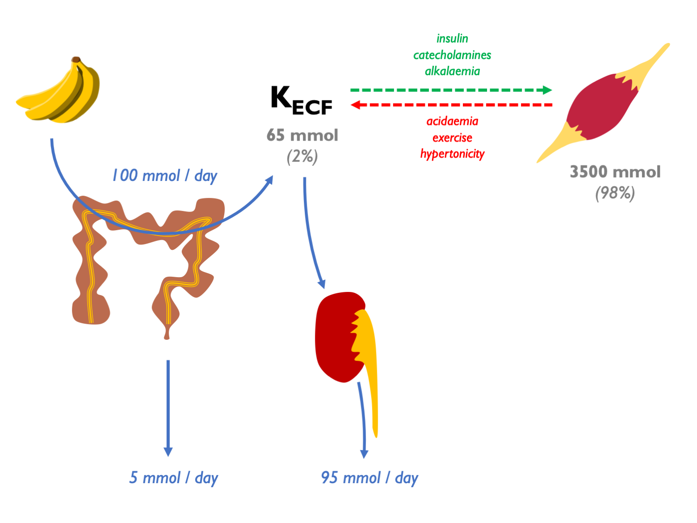
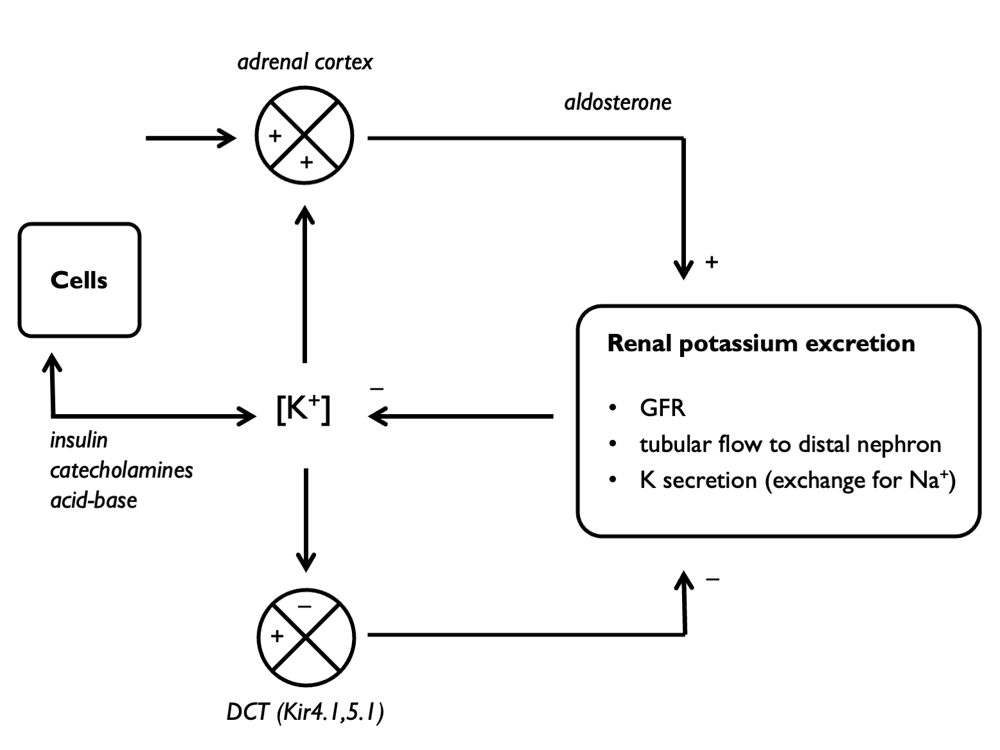
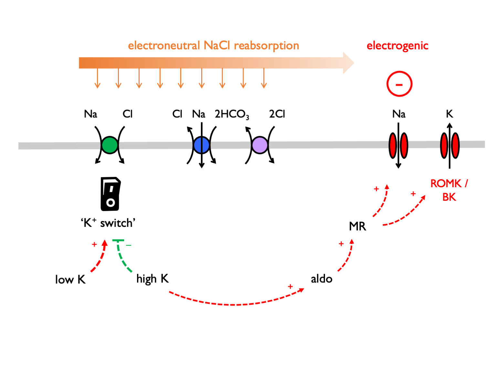
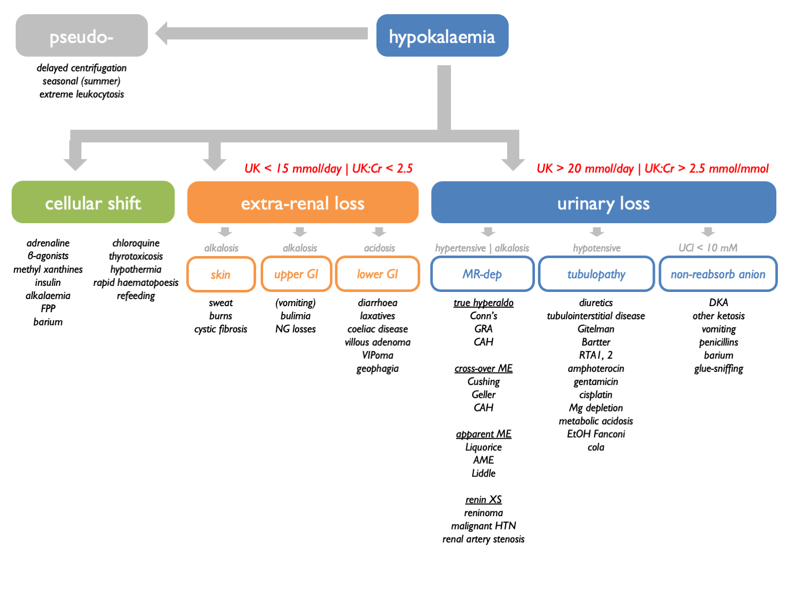
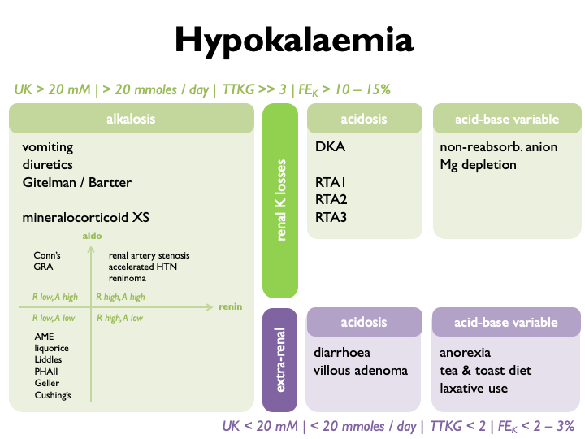
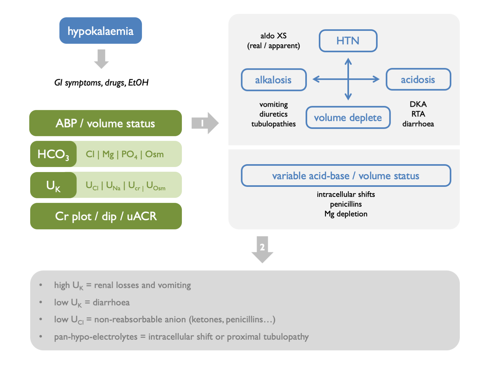
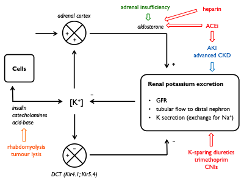
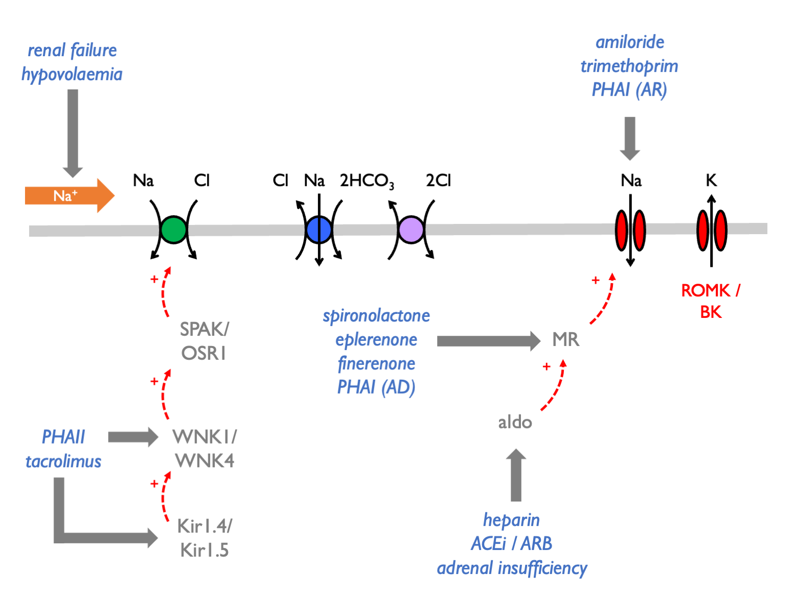

# (PART) Potassium {-}

# Potassium

98% of body K^+^ resides within cells:  



Extracellular potassium is regulated by parallel aldo-dependent and aldo-independent negative feedback loops, with K sensors in the adrenal cortex and DCT respectively:  

  

Therefore plasma [K^+^] is sensed at two points, the DCT and the *zona glomerulosa* of the adrenal gland.  In response to these inputs, the kidney responds by altering the balance between electroneutral (K-sparing) and electrogenic (K-wasting) Na^+^ reabsorption in the distal tubule:




## Quantification

Renal K^+^ excretion may be quantified in a 24 hr urine collection (as mmols / 24 hrs) or on a spot urine sample as:  

- U~K~ 
- U~K~:U~Cr~
- FE~K~
- TTKG (transtubular potassium gradient)  

Correlation between these measures is usually good.  In many cases, a 24 hr urine collection will give the most definitive result.  

FE~K~ usually 5 -- 15 % (can vary 2 -- 150 % in response to variations in K intake).


### Interpretation

In **hypokalaemia**, the following are indicative of *EXTRA-renal* loss:

+  24 hr UK \< 20 mmoles 
+  UK \< 20 mM 
+  UK:UCr \< 1.5 
+  FEK \< 2 -- 3 % 
+  TTKG \< 2 

In **hypokalaemia**, the following are indicative of *RENAL* loss:

+  24 hr UK \> 20 mmoles 
+  UK \> 20 mM 
+  UK:UCr \> 1.5 
+  FEK \> 10 -- 15 % 
+  TTKG \>\> 3 


These  metrics were compared in a [Taiwanese cohort](https://pubmed.ncbi.nlm.nih.gov/15277290/) of patients with hypokalaemia and paralysis.  TTKG (with threshold ~ 3) and UK:UCr (threshold ~ 2.5 mmol/mmol) were able to neatly discriminate between HPP (i.e. non-renal cause) and non-HPP (predominantly renal causes = Gitelman and RTA).  Spot urine UK was not reliable: below 10 mM were all HPP; above 15 mM were all non-HPP but 10 -- 15 mM could be either.  


## TTKG {#TTKG}

The TTKG is used to estimate [K^+^] in the tubular fluid at the end of the CCD (i.e. the point where the tubular fluid was last isotonic to plasma). It accounts for water reabsorption in the MCD. Therefore it is a measure of renal K^+^ secretion -- and of mineralocorticoid bioactivity in the CCD.  

```{block2, type='eqnpanel'}
\begin{equation}
  \text{transtubular potassium gradient, } TTKG=\frac{(U_{K}/P_{K})}{(U_{Osm}/P_{Osm)}}=\frac{U_{K}\times P_{Osm}}{P_{K}\times {U_{Osm}}}
  (\#eq:TTKG)
\end{equation}
```

### Assumptions & pre-requisites {-}

The validity of the TTKG as a measure of luminal [K^+^] in the CCD relies on a number of assumptions: 

i)  there is no K reabsorption or secretion in the MCD (valid except in profound K deficiency / XS)

ii) other solutes (Na / urea) are not secreted or reabsorbed in large amounts in the MCD

iii) the osmolality of the tubular fluid at the end of the CCD is similar to POsm


These assumptions are likely to be met if the following are true: 

i)  UNa \> 25 mM = 2 × maximal [Na^+^] required for ½-maximal K secretion in the distal rat nephron 

ii) UOsm \> 300 because vasopressin is required for optimal K secretion 


### Interpretation {-}

Summary [@choi2008; @ethier1990; @velazquez1993]:

+  on a normal diet, expect: TTKG = 8 -- 9 
+  on a high K diet (or in hyperkalaemia), expect: TTKG \> 10 
+  on a low K diet (or in hypokalaemia), expect: TTKG \< 3 

In hyperkalaemia:

+  TTKG \< 6 suggests impaired bioactivity of aldosterone in the ASDN 
+  TTKG \> 6 suggests non-renal cause *(e.g. K overload or ICF / ECF shifts)* 

TTKG \< 6 may be due to aldosterone deficiency or impaired renal response to aldosterone (e.g. trimethoprim inhibiting ENaC). The TTKG is perhaps most useful when used to distinguish between mineralocorticoid deficiency and mineralocorticoid resistance by looking for a change in TTKG after administering exogenous mineralocorticoid for a few days [@choi2008].

In hypokalaemia:

+  TTKG \> 3 suggests renal K losses 
+  TTKG \< 2 suggests extra-renal cause 


## Hypokalaemia

### Causes of hypokalaemia

i) spurious 
ii) distribution (ECF/ICF shifts) 
iii) K loss (renal or extra-renal)



### Causes of K loss

<!-- +  RENAL  -->
<!--     +  with metabolic alkalosis  -->
<!--         +  *vomiting, diuretics, Gitelman, Bartter, true mineralocorticoid XS, apparent mineralocorticoid XS*   -->

<!--     +  with metabolic acidosis  -->
<!--         +  *RTA I & II & III (acetazolamide)*  -->
<!--         +  *DKA*   -->

<!--     +  with variable acid-base  -->
<!--         +  *Mg-depletion*  -->
<!--         +  *non-reabsorbable anion*   -->

<!-- +  EXTRA-renal  -->
<!--     +  with normal acid-base  -->
<!--         +  *anorexia, tea & toast diet, laxative abuse*   -->

<!--     +  with metabolic acidosis  -->
<!--         +  *diarrhoea, villous adenoma*   -->

```{r, echo=FALSE, message=FALSE, warning=FALSE}
source('~/OneDrive - University of Edinburgh/R files/R Scripts/Markdown_tables.R')
df_table <- read.csv("tables/hypoK.csv", header = FALSE)

df_table %>% table_3cols(caps = T)

```


### Diagnostic approach

Stratify according to the following schemata:  



or




### Vomiting

In [vomiting](#vomit), K is lost through extra-renal and renal routes. Volume contraction stimulates aldosterone; contribution for chloride depletion and bicarbonaturia. A urinary pH and U~Cl~ may be informative.  

The classical differential diagnosis for unexplained hypokalaemia when surruptious vomiting / laxitive use is suspected is as follows:

+-------------------+-----------------+------------+-----------+----------+
|                   | **serum pH**    | **U~Na~**  | **U~K~**  |  **UCa** |
+===================+=================+============+===========+==========+
| **laxative use**  | acidosis        | \< 10 mM   |  \< 20 mM |          |
+-------------------+-----------------+------------+-----------+----------+
| **vomiting**      | alkalosis       | \< 10 mM   |  \< 20 mM | \< 25 mM |
+-------------------+-----------------+------------+-----------+----------+
| **diuretic use**  | alkalosis       | \> 10 mM   |  \> 20 mM | \< 25 mM |
+-------------------+-----------------+------------+-----------+----------+
| **Bartter**       | alkalosis       | \> 10 mM   |  \> 20 mM | \> 40 mM |
+-------------------+-----------------+------------+-----------+----------+

Eating disorder suggested by alternating alkalosis (vomiting) and acidosis (RTA from hypokalaemic nephropathy).


### Non-reasbsorbable anions

Hypokalaemia can be due to renal tubular K secretion in the presence of a non-reabsorbable anion (classically IV penicillins).  Look for low U.Cl and treat with IV 0.9 % NaCl.  Exacerbated in volume depletion (stimulates aldosterone). 


### Hypokalaemic periodic paralysis

AD inheritance. Thought to be caused by K shifts between ICF and ECF. Associated with thyrotoxicosis in oriental males aged 20 -- 50 yrs (in which case high risk of arrhythmias). In this case, treating the thyrotoxicosis will prevent paralysis (as will propranolol).

Triggers:

+  sleep 
+  glucose / insulin / large CHO meal 
+  EtOH 
+  anxiety 

Treatment:

+  attacks *IV K supplements* 
+  prophylaxis *K supplements & K-sparing diuretics* 


## Hyperkalaemia

### Causes of hyperkalaemia  

i)  spurious 
ii) distribution (ECF/ICF shifts) 
iii) impaired renal K^+^ excretion 

Renal excretion of K^+^ may be impaired if any of the following are limited [@hunter2019]: 

- GFR 
- tubular flow rate 
- delivery of Na^+^ to the distal nephron 
- aldosterone signalling in the distal nephron 



Hyperkalaemia is often due to an inappropriate shift from electrogenic to electroneutral Na^+^ reabsorption:  



Therefore the causes of hyperkalaemia are:  

<!-- - excessive potassium load  -->
<!--     - diet  -->
<!--     - IV penicillins   -->
<!-- - transcellular shifts  -->
<!--     - rhabdomyolysis, $\beta$-blockers, digoxin, anaestheic agents, mannitol   -->
<!-- - renal impairment (AKI / CKD)   -->
<!-- - defects in aldosterone signalling  -->
<!--     - impaired renin secretion (diabetes mellitus, $\beta$-blockers, NSAIDS)  -->
<!--     - impaired AngII signalling (ACEi, ARBs)  -->
<!--     - impaired aldosterone synthesis (Addisons's, heparins, ketoconazole)  -->
<!--     - impaired MR activaton (PHAI, spironolactone, eplerenone)   -->
<!-- - defects in electrogenic Na reabosorption  -->
<!--     - ENaC blockade (PHAI, amiloride, triamterene, trimethoprim, pentamidine, Li^+^)  -->
<!--     - NCC activation (PHAII, CNIs)   -->

```{r, echo=FALSE, message=FALSE, warning=FALSE}
source('~/OneDrive - University of Edinburgh/R files/R Scripts/Markdown_tables.R')
df_hyperK3 <- read.csv("tables/hyperK_3col.csv", header = FALSE)
df_hyperK2 <- read.csv("tables/hyperK_2col.csv", header = FALSE)

df_hyperK3 %>% table_3cols(caps = T)
#print("or...")
#df_hyperK2 %>% table_2cols

```

Use FECl response to thiazides as functional test for PHAII (normal response is < 3% increment).  


### Causes of spurious hyper- and hypokalaemia  

PseudohyperK from K-EDTA contamination.   

PseudohyperK due to prolonged delay prior to centrifugation *(blood cells leak K in cold weather)*.  

PseudohypoK due to prolonged delay prior to centrifugation *(blood cells take up K via Na-K-ATPase in the warm; "seasonal pseudohypoK" in summer)*.

PseudohyperK due to leucocytosis (WBC \> 70) -- *K released from cells during clot formation (test by measuring serum and plasma K simultaneously)*.

Familial hyperK due to abnormalities in RBC membrane permeability.
