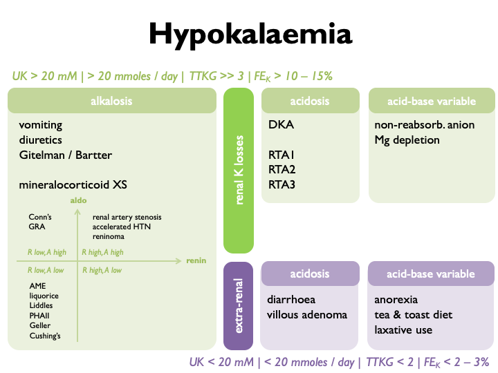

# Hypokalaemia

### Causes of hypokalaemia

i) spurious 
ii) distribution (ECF/ICF shifts) 
iii) K loss (renal or extra-renal)


### Causes of K loss

<!-- +  RENAL  -->
<!--     +  with metabolic alkalosis  -->
<!--         +  *vomiting, diuretics, Gitelman, Bartter, true mineralocorticoid XS, apparent mineralocorticoid XS*   -->

<!--     +  with metabolic acidosis  -->
<!--         +  *RTA I & II & III (acetazolamide)*  -->
<!--         +  *DKA*   -->

<!--     +  with variable acid-base  -->
<!--         +  *Mg-depletion*  -->
<!--         +  *non-reabsorbable anion*   -->

<!-- +  EXTRA-renal  -->
<!--     +  with normal acid-base  -->
<!--         +  *anorexia, tea & toast diet, laxative abuse*   -->

<!--     +  with metabolic acidosis  -->
<!--         +  *diarrhoea, villous adenoma*   -->

```{r, echo=FALSE, message=FALSE, warning=FALSE}
source('~/OneDrive - University of Edinburgh/R files/R Scripts/Markdown_tables.R')
df_table <- read.csv("tables/hypoK.csv", header = FALSE)

df_table %>% table_3cols(caps = T)

```


### Diagnostic approach

Stratify according to the following schemata:  



or


### Vomiting

In [vomiting](#vomit), K is lost through extra-renal and renal routes. Volume contraction stimulates aldosterone; contribution for chloride depletion and bicarbonaturia. A urinary pH and U~Cl~ may be informative.  

The classical differential diagnosis for unexplained hypokalaemia when surruptious vomiting / laxitive use is suspected is as follows:

+-------------------+-----------------+------------+-----------+----------+
|                   | **serum pH**    | **U~Na~**  | **U~K~**  |  **UCa** |
+===================+=================+============+===========+==========+
| **laxative use**  | acidosis        | \< 10 mM   |  \< 20 mM |          |
+-------------------+-----------------+------------+-----------+----------+
| **vomiting**      | alkalosis       | \< 10 mM   |  \< 20 mM | \< 25 mM |
+-------------------+-----------------+------------+-----------+----------+
| **diuretic use**  | alkalosis       | \> 10 mM   |  \> 20 mM | \< 25 mM |
+-------------------+-----------------+------------+-----------+----------+
| **Bartter**       | alkalosis       | \> 10 mM   |  \> 20 mM | \> 40 mM |
+-------------------+-----------------+------------+-----------+----------+

Eating disorder suggested by alternating alkalosis (vomiting) and acidosis (RTA from hypokalaemic nephropathy).


### Non-reasbsorbable anions

Hypokalaemia can be due to renal tubular K secretion in the presence of a non-reabsorbable anion (classically IV penicillins).  Look for low U.Cl and treat with IV 0.9 % NaCl.  Exacerbated in volume depletion (stimulates aldosterone). 


### Hypokalaemic periodic paralysis

AD inheritance. Thought to be caused by K shifts between ICF and ECF. Associated with thyrotoxicosis in oriental males aged 20 -- 50 yrs (in which case high risk of arrhythmias). In this case, treating the thyrotoxicosis will prevent paralysis (as will propranolol).

Triggers:

+  sleep 
+  glucose / insulin / large CHO meal 
+  EtOH 
+  anxiety 

Treatment:

+  attacks *IV K supplements* 
+  prophylaxis *K supplements & K-sparing diuretics* 


## Hyperkalaemia

### Causes of hyperkalaemia  

i)  spurious 
ii) distribution (ECF/ICF shifts) 
iii) impaired renal K^+^ excretion 

Renal excretion of K^+^ may be impaired if any of the following are limited [@hunter2019]: 

- GFR 
- tubular flow rate 
- delivery of Na^+^ to the distal nephron 
- aldosterone signalling in the distal nephron 


Hyperkalaemia is often due to an inappropriate shift from electrogenic to electroneutral Na^+^ reabsorption:  


Therefore the causes of hyperkalaemia are:  

<!-- - excessive potassium load  -->
<!--     - diet  -->
<!--     - IV penicillins   -->
<!-- - transcellular shifts  -->
<!--     - rhabdomyolysis, $\beta$-blockers, digoxin, anaestheic agents, mannitol   -->
<!-- - renal impairment (AKI / CKD)   -->
<!-- - defects in aldosterone signalling  -->
<!--     - impaired renin secretion (diabetes mellitus, $\beta$-blockers, NSAIDS)  -->
<!--     - impaired AngII signalling (ACEi, ARBs)  -->
<!--     - impaired aldosterone synthesis (Addisons's, heparins, ketoconazole)  -->
<!--     - impaired MR activaton (PHAI, spironolactone, eplerenone)   -->
<!-- - defects in electrogenic Na reabosorption  -->
<!--     - ENaC blockade (PHAI, amiloride, triamterene, trimethoprim, pentamidine, Li^+^)  -->
<!--     - NCC activation (PHAII, CNIs)   -->

```{r, echo=FALSE, message=FALSE, warning=FALSE}
source('~/OneDrive - University of Edinburgh/R files/R Scripts/Markdown_tables.R')
df_hyperK3 <- read.csv("tables/hyperK_3col.csv", header = FALSE)
df_hyperK2 <- read.csv("tables/hyperK_2col.csv", header = FALSE)

df_hyperK3 %>% table_3cols(caps = T)
#print("or...")
#df_hyperK2 %>% table_2cols

```

Use FECl response to thiazides as functional test for PHAII (normal response is < 3% increment).  


### Causes of spurious hyper- and hypokalaemia  

PseudohyperK from K-EDTA contamination.   

PseudohyperK due to prolonged delay prior to centrifugation *(blood cells leak K in cold weather)*.  

PseudohypoK due to prolonged delay prior to centrifugation *(blood cells take up K via Na-K-ATPase in the warm; "seasonal pseudohypoK" in summer)*.

PseudohyperK due to leucocytosis (WBC \> 70) -- *K released from cells during clot formation (test by measuring serum and plasma K simultaneously)*.

Familial hyperK due to abnormalities in RBC membrane permeability.
