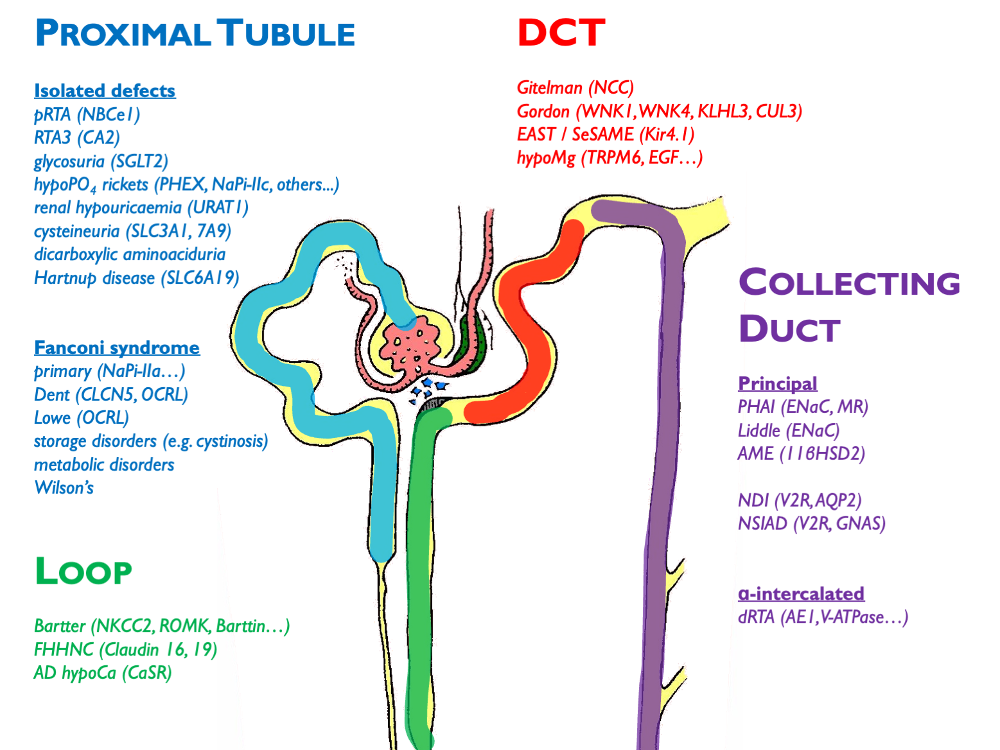
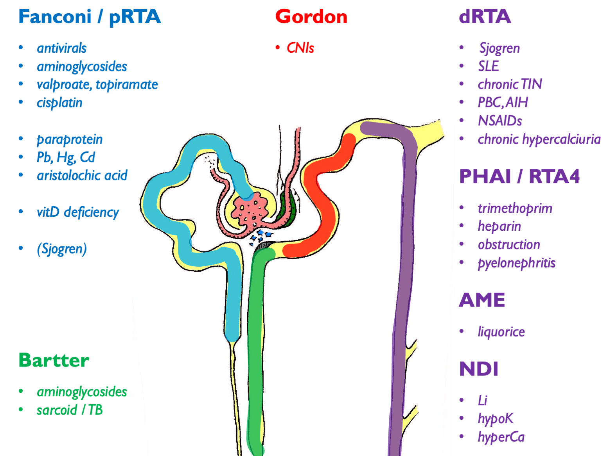
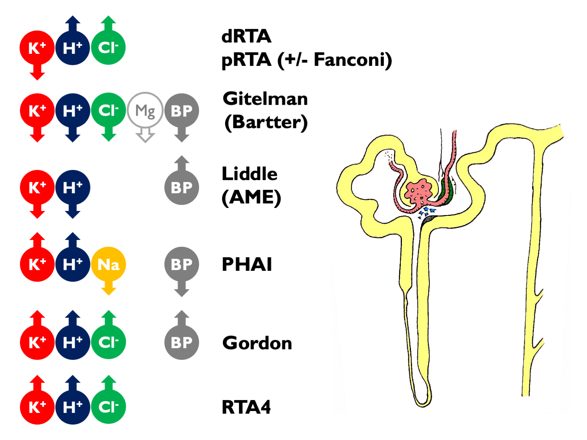
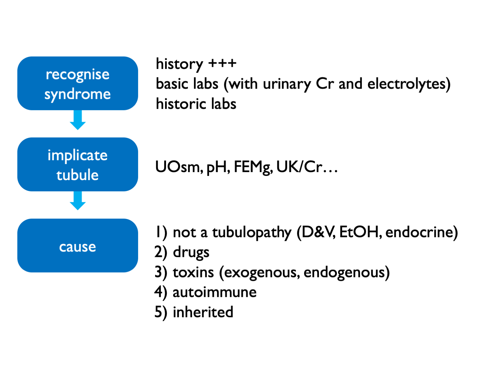

# (PART) Tubulopathies {-}

# Tubulopathies

## Inherited

Other disorders not depicted here (and not necessarily classified as a pure "tubulopathy'): 

- ADTKD (e.g. HNF1b etc.)  
- FHH (CaSR)  
- ciliopathies (ADPKD etc.)  
- metabolic disorders (oxalosis etc.)  
- endocrine disorders (GRA etc.)  

 
 

### Notes on some of the inherited tubulopathies

FHHNC = familial hypomagnesaemia with hypercalciuria and nephrocalcinosis

Inherited pRTA is very rare; inherited dRTA less so.  
Commonest cause of inherited Fanconi syndrome is cystinosis.  
XLD hypophosphataemic rickets is the commonest type; causes elevated FGF23 (phosphatonin).  

X-linked hypercalciuric nephrolithiasis = Dent’s disease, XLR nephrolithiasis, XLR hypophosphataemia rickets, LMWH proteinuria (all CLCn5 mutations).  Encodes chloride channel involved in endosomal acidification – therefore impaired endocytosis by megalin / cubulin.  Defective endocytosis of vitD and PTH lead to calciuria.  

 
 

## Acquired

Autoimmune associations with dRTA other than Sjogren are: SLE, PBC, AIH, thyroiditis.  

Can get dRTA mimic secondary to low UNa (e.g. cirrhosis, heart failure, nephrotic syndrome).  For complete list of 2ry causes see supplemental table 1 in [ESPN clinical practice points, NDT 2021](https://doi: 10.1093/ndt/gfab171).  

 
 

## Tubulopathy syndromes

Other tubulopathy phenotypes:

- NDI and SIAD
- nephrocalcinosis
- recurrent stone-formers
- CKD

 
 

### Interpretation of these electrolyte syndromes

Causes of hyperchloraemic acidosis:  

- diarrhoea / other lower GI losses (upH < 5.5)  
- RTA  
- ureteric diversion  
- iatrogenic chloride excess  

 

Fanconi = glucose, urate, phosphate, aa, LWMP (uPCR > 50 without uACR or RBP), vitD deficiency

Suspect incomplete dRTA if recurrent stones, nephrocalcinosis and borderline low or low-normal TCO2.  

NB can get a transient Fanconi-type syndrome (without glycosuria) in untreated dRTA.  

 
 

## Diagnostic approach in suspected tubulopathy

Exogenous toxins = heavy metals, AA (i.e. herbal preps)
Endogenous toxins = paraproteins

 
 

### Fractional excretions

- FECl <0.5% = not a salt-losing tubulopathy (and therefore purging instead) 
- FEMg >2 – 4% = renal wasting 
- FEPO4 >10 – 20% = renal wasting 

 
 

### Specialised testing

Rarely a role for more specialist testing:  

- urinary acidification test for recurrent stone-formers / nephrocalcinosis (NOT for frank acidosis) 
- thiazide test for Gitelman or Gordon (FECl) 
- urinary drug screen
- exome testing (available in Scotland for Bartter & Gitelman, Cystinuria, Nephrocalcinosis & Nephrolithiasis (large panel), PHA1 (paeds), tubulopathies and RTA panel (very large panel)

 
 

## Sjogren syndrome

Spectrum of kidney disease including (often overlapping):

- pure tubulopathies  
- tubuolocentric lymphocytic TIN (= "extraglandular epithelialitis")  
- IC MPGN of which 66% cryoglobulinaemia  
- cryoglobulinaemic vasculitis  

 
 

dRTA associated with Ro, La, hyperIg.  
NDI common but almost always well-compensated.  
GN associated with lymphoma.  

<!--

 
 

## Management
 
-->

<!-- 

### Supplements

- NEED TO DO: quantity of all supplements - uptodate?

- Slow K = KCl = start 2 tabs bd = less disgusting than SandoK  
- SlowNa = start 3 tabs tds and titrate up to 10 tabs tds = half daily losses in Gitelman  
- UroCitK = Kcitrate = start 2 tabs bd = crystals on wax tablet (appear in stool)  
- SMC approval for Sibnayal (K citrate + KHCO3 prolonged-release granules) = first licensed Rx for dRTA; better palatability in RCT  

NB K citrate improves bone health in healthy elderly!  

- MagTab SR = Mglactate = start 2 tabs bd  
- Organic Mg salts (aspartate or lactate) have better bioavailability than inorganic salts and therefore cause less diarrhoea  

 

Chronic hypoK probably okay; danger during intercurrent D&V.  

 
 

--> 

<!-- ### Salt-losing nephropathy   -->

<!-- Rx of **Gitleman** (see [KDIGO controversies](http://dx.doi.org/10.1016/j.kint.2016.09.046) and UKKA / RCA guidelines):   -->

<!-- - target K 3.0 mM and Mg 0.60 mM   -->
<!-- - use KCl, starting 40 mmol/day   -->
<!-- - not on an empty stomach; can give in water or syrup   -->
<!-- - inorganic Mg salts > low bioavailability > osmotic diarrhoea   -->
<!-- - organic salts (aspartate, citrate, lactate) better   -->
<!-- - start 300 mg (~12 mmol) per day as SR tabets, bd - qds with meals   -->
<!-- - only rarely amiloride / MRAs / indometacin   -->
<!-- - almost always avoid RASi (aggravate NaCl wasting) - unless 2ry FSGS   -->
<!-- - sick day rules (get bloods checked whenever unwell) - see supplemental table in KDIGO paper   -->
<!-- - elective surgery if K > 3 and Mg > 0.5   -->

