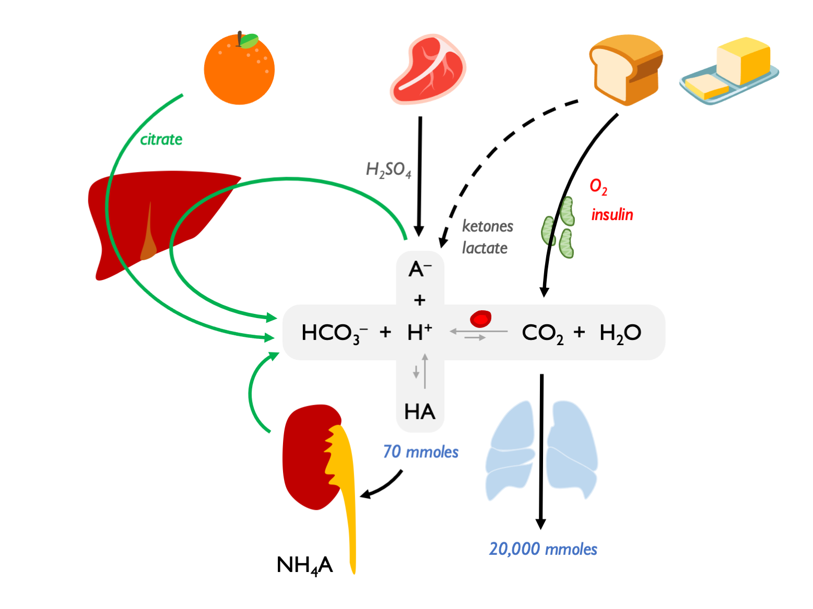
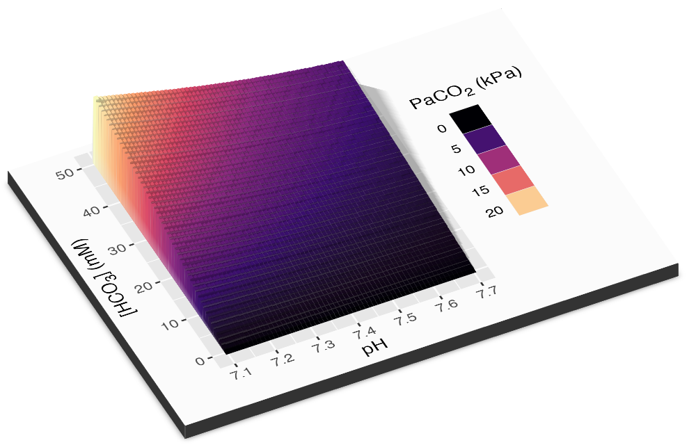
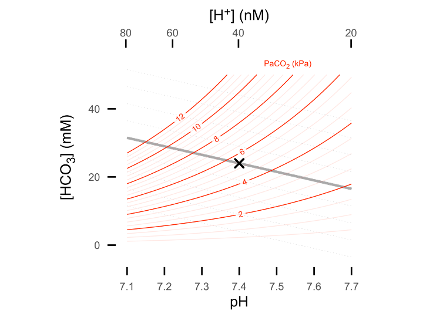
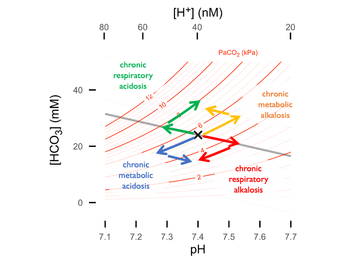
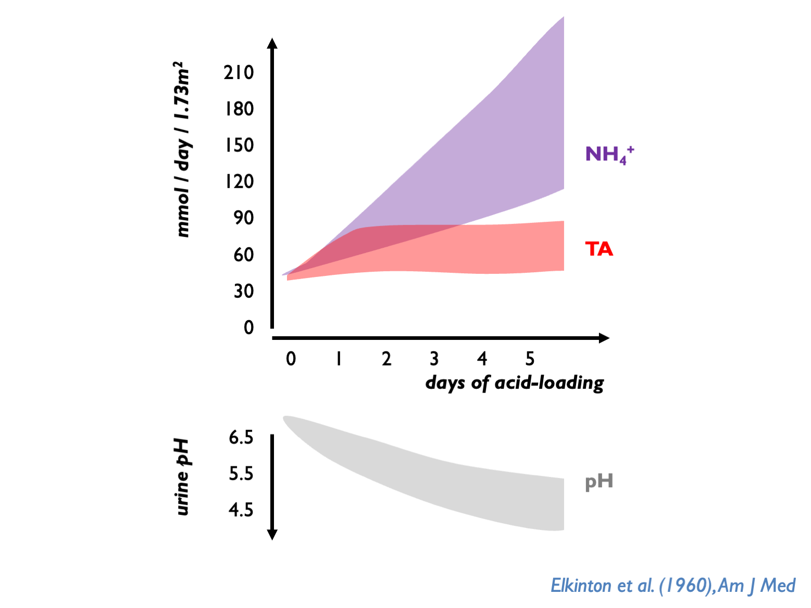
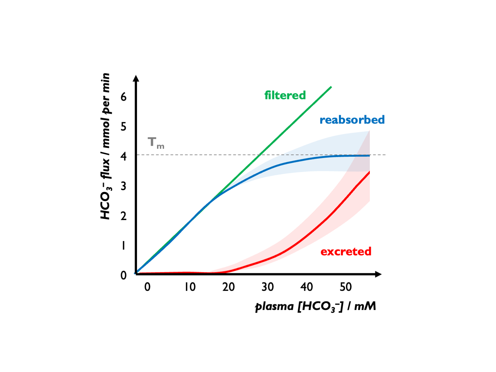

# (PART) Acid-base {-}

# Acid-base & chloride

## Acid-base homeostasis  

Summary of the dietary sources of acids and alkali and the role of the kidney in generating bicarbonate (to aid the excretion of non-volatile acid):

## pH

\BeginKnitrBlock{eqnpanel}
\begin{equation}
  pH=-log[H^{+}]
  (\#eq:pH1)
\end{equation}

\begin{equation}
  H^{+} = 10^{pH}
  (\#eq:pH2)
\end{equation}
    
\EndKnitrBlock{eqnpanel}

## Adaptation

The relationship between pH, PaCO~2~ and HCO~3~ is described by the Henderson-Hasselbalch equation:  

\BeginKnitrBlock{eqnpanel}
\begin{equation}
  pH = pKa+log \frac{[A^-]}{[HA]}  
  (\#eq:HH1)
\end{equation}
    
\begin{equation}
  pH = 6.1 + log \frac{[HCO_3]}{\alpha .PaCO_2}  
  (\#eq:HH2)
\end{equation}

\EndKnitrBlock{eqnpanel}

This relationship can be visualised in 3D...

...or 2D in the form of a Davenport plot (shown below) - or alternatively as a Siggard-Anderson plot (pH vs. PaCO~2~ with BE nomogram lines).  

Metabolic adaptation to respiratory alkalosis:  

+  acute (5 -- 10 mins) HCO~3~ 16 -- 18 mM *buffering by serum HCO~3~* 
+  chronic (2 -- 3 days) HCO~3~ 12 -- 15 mM *renal excretion of HCO3* 

Respiratory adaptation:  

+  for each mM HCO~3~ \< 25 PaCO~2~ should drop by... 0.16 kPa (1.2 mmHg) 
+  for each mM HCO~3~ \> 25 PaCO~2~ should rise by... 0.08 kPa (0.6 mmHg) 
+  Winter's formula: PaCO2 (mmHg) = (1.5 × HCO~3~) + 8 +/- 2 *(in metabolic acidosis)*  

 
 

## Renal control of acid-base homeostasis

Renal net acid excretion is determined by urinary titratable acid, ammonium and bicarbonate:  

\BeginKnitrBlock{eqnpanel}
\begin{equation}
  NAE = V \times (U_{NH_{4}^+} + U_{TA} - U_{HCO_{3}^-})  
  (\#eq:NAE)
\end{equation}

\EndKnitrBlock{eqnpanel}

In the face of a daily acid load, the main job of the kidneys is to regenerate HCO~3~ for the ECF in order to replace that lost through buffering of non-volatile acids.  It does this through mechanisms that keep urine pH ~ 6 to minimise risks of uric acid precipitation (in acid urine) or calcium phosphate precipitation (alkaline urine).  

The three key processes are:  

i) reabsorption of filtered HCO3  
ii) excretion of titratable acid (H~2~PO~4~) = net HCO~3~ reabsorption  
ii) excretion of ammonium (glutamine > NH3 + H+ > NH~4~+) = net HCO~3~ reabsorption  

 
 

### Normal renal response to chronic acidosis

The normal response of the kidneys to chronic acidosis is to upregulate urinary NH~4~ excretion.  This was illustrated in historical acid-loading studies:

 

The preferential use of NH~4~ over TA is probably an evolutionary defense against kidney stones.  NH~4~ tends to keep upH around 6.0 - thus avoiding very acid urine (risk of uric acid precipitation) or very alkaline urine (risk ofCaHPO4 precipitation).  

Normally, kidney has to dispose ot 70 mmol non-volatile acid per day through TA and NH~4~.  uNH~4~ therefore normally 30 – 40 mmol per day; up to 100 - 200 mmol per day after acid-loading (Kamel & Halperin, KI Reports 2021; Uribarri, AJKD 2022).  uNH~4~ (directly-measured) higher on Western than plant-based diets (Uribarri AJKD 2022).  

 
 

### Renal response to alkalosis

An alkalosis will correct automatically as HCO~3~- exceeds the Tm.  

There is an apparent Tm for HCO~3~-, set close to 25 mM but variable and influenced by various factors (GFR, luminal pH, hormonal factors etc.) For example, during volume depletion, stimulation of Na reabsorption (NHE activity) will increase HCO3- re-absorption, so leading to an increase in the apparent Tm for HCO3-. Under normal circumstances, FEHCO3 is \< 0.1% (Lote).

In alkalosis, bicarbonaturia can drive cation loss (e.g. hypokalaemia)
