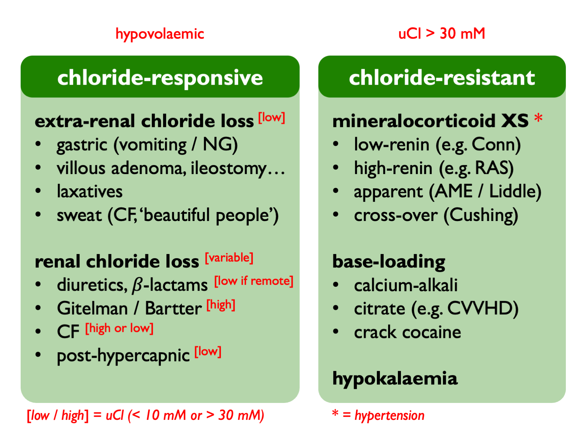

# Metabolic alkalosis (& chloride homeostasis)  

## Causes of a metabolic alkalosis  

The causes of a metabolic alkalosis can be classified as being either due to chloride depletion (and therefore `chloride responsive`) or due to other causes (`chloride resistant`) [@luke2012a].  

<!-- +  low ECF volume = chloride-depletion / contractional = chloride-responsive  -->
<!--     +  *vomiting / NG losses*  -->
<!--     +  *loop / thiazide diuretics \**  -->
<!--     +  *Bartter's / Gitelman's \**  -->
<!--     +  *colonic villous adenoma / congenital chloride diarrhoea / high-volume ileostomy (rare)*   -->

<!-- +  normal ECF volume = chloride-resistant  -->
<!--     +  renal H + loss  -->
<!--         +  *true mineralocorticoid XS (low-renin / high-renin)*  -->
<!--         +  *apparent mineralocorticoid XS (and Liddle's)*  -->
<!--         +  *Cushings*  -->
<!--         +  *post-hypercapnic alkalosis (UCl \< 10 mM)*  -->
<!--         +  *milk-alkali syndrome*   -->
<!--     +  intracellular H + shift  -->
<!--         +  *hypokalaemia*   -->

<table>
<tbody>
  <tr>
   <td style="text-align:left;font-weight: bold;background-color: white !important;"> LOW ECF VOLUME = CHLORIDE-DEPLETION / CHLORIDE-RESPONSIVE </td>
   <td style="text-align:left;font-style: italic;background-color: white !important;"> GI chloride loss </td>
   <td style="text-align:left;"> vomiting / NG losses </td>
  </tr>
  <tr>
   <td style="text-align:left;font-weight: bold;background-color: white !important;">  </td>
   <td style="text-align:left;font-style: italic;background-color: white !important;"> GI chloride loss </td>
   <td style="text-align:left;"> colonic villous adenoma / congenital chloride diarrhoea / high-volume ileostomy (rare) </td>
  </tr>
  <tr>
   <td style="text-align:left;font-weight: bold;background-color: white !important;">  </td>
   <td style="text-align:left;font-style: italic;background-color: white !important;">  </td>
   <td style="text-align:left;"> loop / thiazide diuretics * </td>
  </tr>
  <tr>
   <td style="text-align:left;font-weight: bold;background-color: white !important;">  </td>
   <td style="text-align:left;font-style: italic;background-color: white !important;">  </td>
   <td style="text-align:left;"> Bartter / Gitelman * </td>
  </tr>
  <tr>
   <td style="text-align:left;font-weight: bold;background-color: white !important;"> NORMAL ECF VOLUME = CHLORIDE-RESISTANT </td>
   <td style="text-align:left;font-style: italic;background-color: white !important;"> renal H + loss </td>
   <td style="text-align:left;"> true mineralocorticoid XS (low-renin / high-renin) </td>
  </tr>
  <tr>
   <td style="text-align:left;font-weight: bold;background-color: white !important;">  </td>
   <td style="text-align:left;font-style: italic;background-color: white !important;">  </td>
   <td style="text-align:left;"> apparent mineralocorticoid XS (and Liddle’s) </td>
  </tr>
  <tr>
   <td style="text-align:left;font-weight: bold;background-color: white !important;">  </td>
   <td style="text-align:left;font-style: italic;background-color: white !important;">  </td>
   <td style="text-align:left;"> Cushings </td>
  </tr>
  <tr>
   <td style="text-align:left;font-weight: bold;background-color: white !important;">  </td>
   <td style="text-align:left;font-style: italic;background-color: white !important;">  </td>
   <td style="text-align:left;"> post-hypercapnic alkalosis (UCl &lt; 10 mM) </td>
  </tr>
  <tr>
   <td style="text-align:left;font-weight: bold;background-color: white !important;">  </td>
   <td style="text-align:left;font-style: italic;background-color: white !important;">  </td>
   <td style="text-align:left;"> milk-alkali syndrome </td>
  </tr>
  <tr>
   <td style="text-align:left;font-weight: bold;background-color: white !important;">  </td>
   <td style="text-align:left;font-style: italic;background-color: white !important;">  </td>
   <td style="text-align:left;"> hypokalaemia </td>
  </tr>
</tbody>
</table>

\* in chloride-responsive states UCl \< 10 mM except where chloride is being lost in the urine (i.e. diuretics / Gitelman / Barrter syndrome).

Perhaps a more useful classification would be:

i) Pendrin-dependent with volume depletion = extra-renal chloride loss  
ii) ENaC-dependent with volume depletion = renal chloride loss (secondary aldosteronism)  
iii) ENaC-dependent with volume expansion = primary mineralocorticoid XS  
iv) base-loading  

Initial diagnostic work-up includes checking volume status, blood pressure, serum chloride and urinary chloride.  Checking renin and aldosterone levels then helpful if suspected mineralocorticoid XS.  

As a general rule, extreme alkalosis (HCO~3~ \> 45 mM) can *only* be due to vomiting (and consider pyloric stenosis / Zollinger Ellison syndrome).  

### Specific syndromes and their mechanisms {#alksyndromes}

**Cystic fibrosis**: loss of chloride in sweat and / or downregulation of renal pendrin (so uCl may be high or low).  

**Post-hypercapnic alkalosis**: occuds when chronic hypercapnoea is abruptly corrected - usuall in the context of mechanical ventilation.  Chronic increase in renal HCO~3~ reabsorption and ammoniagenesis leads to loss of urinary NH~4~Cl.  Therefore induces a low-Cl state that [requires Cl resuscitation](https://pubmed-ncbi-nlm-nih-gov.eux.idm.oclc.org/13749130/) to correct.  

**Pendred syndrome** (AR): no acid-base disturbace at baseline but susceptible to alkalosis when provoked (e.g. by thiazides).  

**Calcium-alkali syndrome** (formerly 'milk-alkali'): triad of hypercalcaemia, alkalosis, AKI.  Caused by ingestion of large quantities of calcium (+/- alkali); often exacerbated by thiazides.  Inhibition of CaSR in TALH causes salt-wasting (and hence chloride depletion and secondary hyperaldosteronism) and alkalosis stimulates Ca^2+^ reabsorption through [TRPV5](https://pubmed-ncbi-nlm-nih-gov.eux.idm.oclc.org/20413609/) in DCT.  So a vicious cycle; abort with IV NaCl.  

**Crack cocaine**: sometimes made with drain cleaner.  

**Hypokalaemia**: associated with alkalosis because of a common underlying cause (e.g. hyperaldosteronsim), cell shifts and / or hypokalaemia stimulating ammoniagenesis.  

 

## Chloride

U~Cl~ NR = 100 -- 250 mmol / 24 hrs

In chloride-responsive alkalosis, UCl \< 10 mM:  

- vomiting  
- villous adenoma  
- congenital chloride diarrhoea  
- recent diuretics (pause on clinic day in surruptitious use)

In chloride-resistant alkalosis UCl \> 10 -- 30 mM (and also if chloride loss is due to diuretics / tubulopathies).  

UCl is persistently low after vomiting and is therefore a useful test for surreptitious vomiting.

 
 

### Chloride-depletion alkalosis

In chloride depletion, reduced ECF volume leads to reduced GFR (less filtered NaHCO~3~) and increased Na reabsorption. Thus NaHCO~3~ reabsorption is increased. Increased distal Na reabsorption leads to increased acid excretion.  Therefore, after [vomiting](#vomit), an acid urine is produced (paradoxically) in the face of a metabolic alkalosis. Treatment is volume expansion with NaCl and correction of hypoK.
