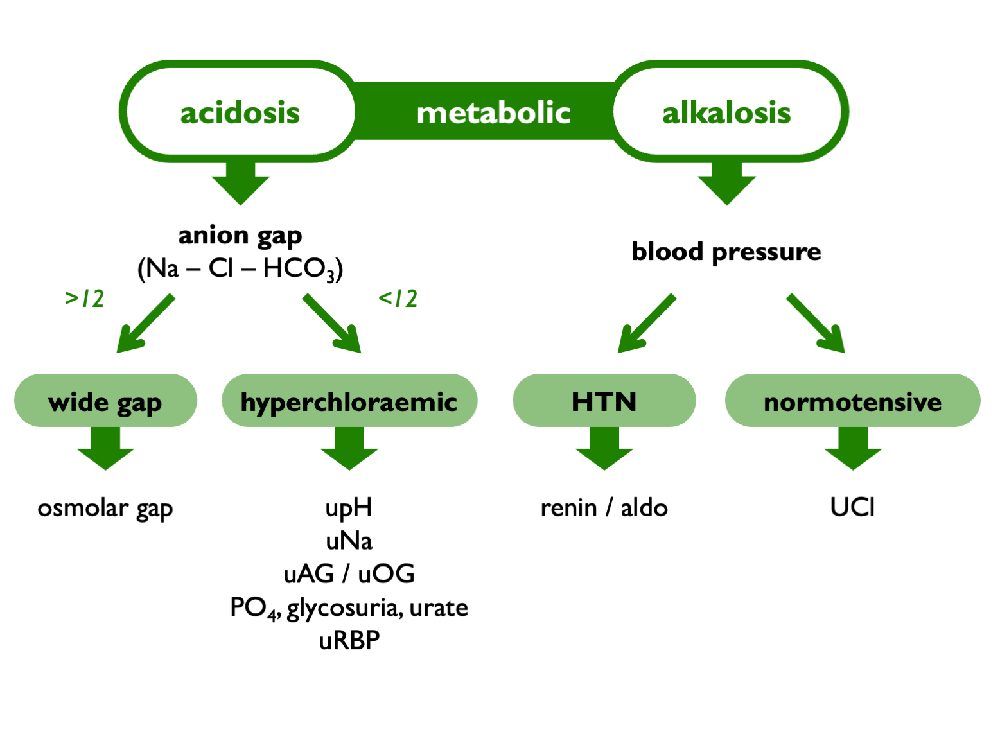

# Blood gas interpretation

## General approach  

\BeginKnitrBlock{algpanel}
Systematic approach to blood gas interpretation:  

1)  PaO~2~ +/- Aa gradient (if arterial gas)    
2)  pH -- acidaemia or alkalaemia?    
3)  PaCO~2~ -- is there a primary respiratory disorder?  
4)  HCO3~3~ -- is there a primary metabolic disorder?  
5)  PaCO~2~ & HCO~3~ -- is any compensation appropriate; any mixed disorders?  
6)  fancy tests to classify primary disorder or identify mixed disorders (gaps, delta gaps etc.)  

\EndKnitrBlock{algpanel}

 

Can be really helpful to [plot results](https://www.kidneyfish.net/gases/) on a Davenport or Siggard-Andersen plot.  

 
 

## VBG vs. ABG

Generally [good agreement](https://www.uptodate.com/contents/venous-blood-gases-and-other-alternatives-to-arterial-blood-gases#H1942481) between VBG and ABG.  Should expect pH to be ~0.04 pH units lower and PaCO$_2$ to be ~0.6 kPa higher (and HCO$_3$ to be the same).  

However, can be large discrepancies in patients with shock or extremes of acid-base disturbance.  

 
 

## Measures of acid-base status

### What is on the blood gas report?

`pH`, `PaCO2` and `PaO2` are all measured directly.  The [other parameters](https://www.ncbi.nlm.nih.gov/pmc/articles/PMC5873626/) are calculated:  

- `HCO3act` = 'actual' = what the bicarb is in the sample  
- `HCO3std` = 'standard' = what the bicarb would have been if PaCO2 was normal (i.e. under standard conditions: T37, fully oxygenated, PaCO2 5.3 kPa)
- `BE` = the amount of strong acid that must be added to each liter of fully oxygenated blood to return the pH to 7.40 under standard conditions  
- `BEecf` = `SBE` = standard BE = assuming Hb 5 g/dL (rationale being that Hb buffers all ECF, not just plasma)  

HCO3std and SBE give the best metrics of the metabolic component of any disturbance.   (SBE better than BE as less sensitive to changes in HCT.)  These metrics correlate: very approximately, stdHCO3 = 24 + SBE unless extreme anaemia / polycythaemia (as Hb is important non-HCO3 buffer) or extreme disturbance in Na, Cl, alb, lactate.  Theoretically, SBE ought to perform better and there is a small literature to support that assertion in extreme acid-base disturbances, but can use either most of the time.  

 

Therefore, use:  

- for AG: actHCO$_3$  
- for compensation rules: actHCO$_3$  
- for plots: actHCO$_3$ 
- ...or use TCO$_2$ if actHCO$_3$ not available  

 

### What about TCO2?  

Measured as the amount of CO$_2$ liberated from serum by the addition of a strong acid to shift pH to well below pKa (Centor, 1990).  CO$_2$ detected with indicator dye.  

~95% of TCO$_2$ exists as HCO$_3$.  Under normal conditions, HCO3 $\approx$ 24 mM; CO$_2$ $\approx$ 1.2 mM.  Therefore venous TCO$_2$ will usually read 2–4 mM higher than a concurrent calculated HCO$_3$ on an ABG sample; 1–2 mM of this difference represents a true difference between venous and arterial blood; 1–2 mM represents a contribution of dissolved CO$_2$ to TCO$_2$.  

Must be processed promptly; exposure to air will result in loss of TCO$_2$ (up to 6 mM per hr).  

 

### Unit conversions  

1 mmHg $\approx$ 0.133 kPa
1 kPa $\approx$ 7.5 mmHg  

 
 

## Compensation rules

### Principles

HCO$_3$ and TCO$_2$ are co-dependent through two mechanisms:  

i) interconversion though bulk shifts in their equilibrium (carbonic acid buffer system);  
ii) renal or respiratory compensation  

A stdHCO$_3$ or SBE will reveal the metabolic component, correct for process i).  

Alternatively, actHCO$_3$ can be interrogated using compensation rules or a Davenport plot, to assess for mixed disorders / compensation.  

 
 

### "Boston Rules"

Schwartz & Relman, NEJM 1963; Berend et al., NEJM 2014:  

- acute respiratory acidosis: 1 mM rise in HCO3 per 10 mmHg rise in PaCO2  
- acute respiratory alkalosis: 2 mM fall ditto  
- chronic respiratory acidosis: 4 mM rise in HCO3 per 10 mmHg rise in PaCO2  
- chronic respiratory alkalosis: 5 mM fall ditto  
- metabolic acidosis: PaCO2 in mmHg = 1.5 * HCO3 + 8 = 'Winter's formula' (Dell & Winters, 1967)  
- metabolic alkalosis: PaCO2 in mmHg = 0.7 * HCO3 + 20  

 

### [Severinghaus](https://pubmed.ncbi.nlm.nih.gov/9671365/) rules for SBE:  

- acute respiratory disturbance: no change in BE
- chronic respiratory disturbance: BE changes by 0.4 * PaCO2 
- metabolic acidosis: PaCO2 changes by 1 * BE
- metabolic alkalosis: PaCO2 changes by 0.6 * BE

 

### Error bars

Expected range probably around [+/- 5 mM](https://pubmed-ncbi-nlm-nih-gov.eux.idm.oclc.org/18308967/) for bicarbonate response to respiratory perturbations.  There are limits to the extent to which compensation can occur, so the compensation curves is likely to flatten off at extremes.  For example, requirement for O2 exchange may limit the extent to which ventilation rate can be lowered to compensate for a metabolic alkalosis.  

 

## Further testing in metabolic disorders

