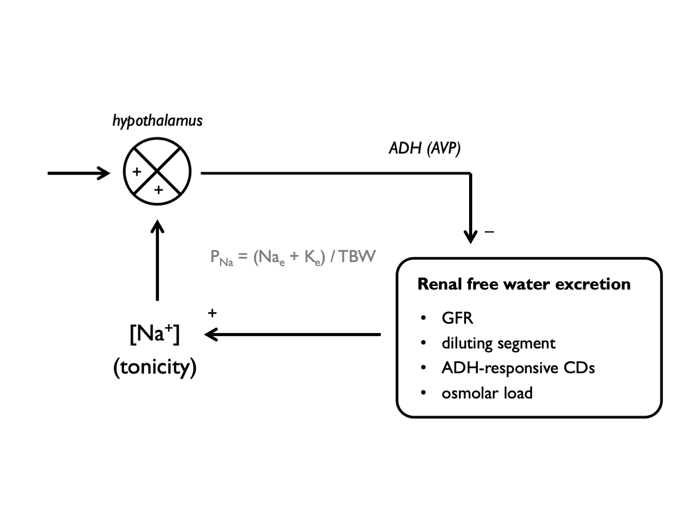

# (PART) Water and sodium {-}

# Water and sodium

## Total body water

Sometimes it is helpful to estimate total body water.  (For example, this is a prerequisite to calculating water excess \@ref(eq:aqxs) in hyponatraemia or water deficit in hypernatraemia \@ref(eq:aqdef).)

\BeginKnitrBlock{eqnpanel}
\begin{equation}
  \text{total body water, }TBW = \text{body weight}\times k
  (\#eq:TBW)
\end{equation}

where k= 0.6 in men; 0.5 in women, elderly men or obesity and 0.45 in elderly women.  

An appropriate value for k - taking into account sex and body habitus - should be estimated, bearing in mind that muscle is ~70% water and adipose tissue is ~10% water.  

\EndKnitrBlock{eqnpanel}

## Plasma sodium

Na^+^ is the dominant extracellular cation and, as such, its concentration depends on the total body stores of water and exchangeable ions.  Na^+^ and K^+^ are the most abundant cations (and will be accompanied by anions to maintain electroneutrality), thus:

\BeginKnitrBlock{eqnpanel}
The Edelman equation:  
\begin{equation}
  P_{Na} = \frac{Na_{e} + K_{e}}{TBW}
  (\#eq:edelman)
\end{equation}

...where Na~(e)~ and K~(e)~ are exchangeable sodium and potassium and TBW is total body water.  For an elegant discussion of the derivation of this equation see [@rose1986].

\EndKnitrBlock{eqnpanel}

Any abnormality in plasma sodium concentration (P~Na~) usually reflects a problem with water homeostasis.  Hyponatraemia = over-hydration; hypernatraemia = dehydration.  

The role of potassium is often under-appreciated. Depletion of total body potassium (e.g. after vomiting, diarrhoea or diuretic use) can result in hyponatraemia; replenishing K^+^ stores can help to correct this [@rose1986].  

Plasma tonicity is regulated through a negative-feedback loop, with renal free-water excretion as the effector arm:  

## Renal water excretion

The kidneys are able to respond to purturbations in water balance by generating a dilute or a concentrated urine, varying U~Osm~ in the range 50 - 900 mOsm/kg [@lote2012a].  

Production of a `dilute urine` (i.e. excretion of free water) relies on three processes:  

1. glomerular filtration (of water and solute)  
2. generation of lumenal free water in the water-impermeable diluting segment (thick ascending loop of Henle and distal convoluted tubule)  
3. excretion of free water in water-impermeable collecting ducts in the absence of anti-diuretic hormone (ADH)  

 

Production of a `concentrated` urine (i.e. retention of free water) relies on:  

1. the generation of a concentrated inner medulla (due to the action of countercurrent multiplier in the loop of Henle and urea recycling);  
2. the reabsorption of water from the collecting ducts in the presence of ADH  

 
 

The range over which the kidneys can vary U~Osm~ may be limited by anything that can limit these processes (e.g. chronic renal insufficiency, diuretics, unregulated ADH secretion).  The ability of the kidneys to excrete free water is determined by U~Osm~ and by the total osmolar content of the urine, as we shall see \@ref(eq:UOsm1).  A large osmolar load will drive a solute diuresis; a low amount of filtered solute will limit water excretion.  

## Urine osmolality {#UOsm}

When an `osmolar load` (OL) is excreted in a discrete `volume` of urine (V), those two variables will determine the urine `osmolality` (U~Osm~):

\BeginKnitrBlock{eqnpanel}
\begin{equation}
  \text{urine osmolality, } U_{Osm} = \frac{OL}{V}
    (\#eq:UOsm1)
\end{equation}

which, when re-arranged becomes:

\begin{equation}
  \text{urine volume, } V = \frac{OL}{U_{Osm}}
    (\#eq:UOsm2)
\end{equation}
\EndKnitrBlock{eqnpanel}

The reciprocal relationship between V and U~Osm~ means that the maximum urine volume used to excrete an osmolar load is determined by the lowest achievable urine osmolality in diuresis (and the minimum urine volume by the maximum possible urine osmolality in antidiuresis):

\BeginKnitrBlock{eqnpanel}
\begin{equation}
  \text{maximum urine volume, } V_{max} = \frac{OL}{U_{Osm_{min}}}
    (\#eq:UOsmmin)
\end{equation}

\begin{equation}
  \text{minimum urine volume, } V_{min} = \frac{OL}{U_{Osm_{max}}}
  (\#eq:UOsmmax)
\end{equation}
\EndKnitrBlock{eqnpanel}

These simple relationships can be used to explore a number of phenomena, such as:  

+ explaining why drinking seawater causes dehydration  
+ explaining why giving 0.9% NaCl can exacerbate hyponatraemia in some circumstances  
+ calculating the water intake that would cause hyponatraemia  
+ explaining why poor diet (low dietary solute intake) can cause hyponatraemia    

These are considered in more detail in [this blog post](https://www.kidneyfish.net/post/e-mc-2). 
