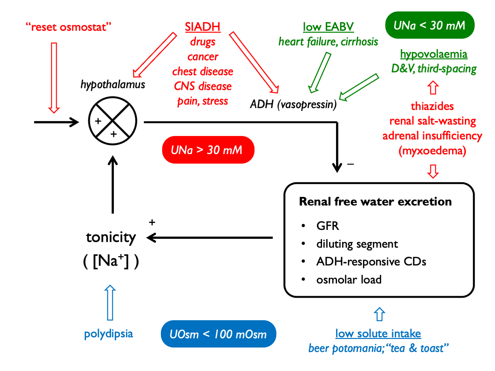

# Hyponatraemia

Hyponatraemia is caused by free water excess.  When this is associated with reduced plasma tonicity, this can cause cerebral oedema.  

The general approach to diagnosis is as follows: 

\BeginKnitrBlock{algpanel}
**Order of operations in hyponatraemia:**  
  
1. confirm true hypotonic hyponatraemia
    + correct for [glucose] in hyperglycaemia
    + check P~Osm~
2. determine clinical volume status  
3. check U~Osm~ (< 100 mM suggests urine water excretion limited by low solute load or driven by XS water intake - i.e. hypothalamic-ADH-kidney axis intact)  
4. check U~Na~ (< 30 mM suggests low effective arterial blood volume)  

And remember to consider:  

+ is there total body K depletion?
+ is solute intake low?
+ check U~K~ or calculate free water clearance to guide therapy
+ calculate FE~urate~ in tricky cases  

\EndKnitrBlock{algpanel}

The causes of hyponatraemia can be classified by volume status, U~Osm~ and U~Na~:

### Drug causes of hyponatraemia

<table>
<tbody>
  <tr>
   <td style="text-align:left;font-weight: bold;background-color: white !important;"> Mechanism </td>
   <td style="text-align:left;"> Drugs </td>
  </tr>
  <tr>
   <td style="text-align:left;font-weight: bold;background-color: white !important;"> Impaired urinary dilution </td>
   <td style="text-align:left;"> thiazide diuretics </td>
  </tr>
  <tr>
   <td style="text-align:left;font-weight: bold;background-color: white !important;"> Renal salt wasting </td>
   <td style="text-align:left;"> NSAIDs / antibiotics / PPIs (if AIN) </td>
  </tr>
  <tr>
   <td style="text-align:left;font-weight: bold;background-color: white !important;"> SIADH </td>
   <td style="text-align:left;"> antidepressants (SSRIs, TCAs) </td>
  </tr>
  <tr>
   <td style="text-align:left;font-weight: bold;background-color: white !important;">  </td>
   <td style="text-align:left;"> antipsychotics </td>
  </tr>
  <tr>
   <td style="text-align:left;font-weight: bold;background-color: white !important;">  </td>
   <td style="text-align:left;"> anticonvulsants (esp. carbemazepine) </td>
  </tr>
  <tr>
   <td style="text-align:left;font-weight: bold;background-color: white !important;">  </td>
   <td style="text-align:left;"> anti-cancer (vinscritine, cisplatin…) </td>
  </tr>
  <tr>
   <td style="text-align:left;font-weight: bold;background-color: white !important;">  </td>
   <td style="text-align:left;"> opioids </td>
  </tr>
  <tr>
   <td style="text-align:left;font-weight: bold;background-color: white !important;">  </td>
   <td style="text-align:left;"> MDMA </td>
  </tr>
  <tr>
   <td style="text-align:left;font-weight: bold;background-color: white !important;"> Reset osmostat </td>
   <td style="text-align:left;"> venlafaxine </td>
  </tr>
  <tr>
   <td style="text-align:left;font-weight: bold;background-color: white !important;">  </td>
   <td style="text-align:left;"> carbamazepine </td>
  </tr>
  <tr>
   <td style="text-align:left;font-weight: bold;background-color: white !important;"> Excessive thirst </td>
   <td style="text-align:left;"> MDMA </td>
  </tr>
</tbody>
</table>

### Correction for hyperglycaemia  
Hyponatraemia can result from an influx of water into the vascular (and interstitial) space in presence of an abnormaly high concentration of a plasma osmole.  The commonest such clinical scenario is that of hyperglycaemia.  (Hyponatraemia in this context is not dangerous *per se* because plasma tonicity is maintained near normal by glucose, an [effective osmole](#tonicity).)  
 
 

The value that P~Na~ will correct to with resolution of hyperglycaemia can be estimated: 

\BeginKnitrBlock{eqnpanel}
\begin{equation}
  \text{corrected } P_{Na}, cP_{Na} = P_{Na}+2.4 \times \frac{P_{glucose}-5.5\text{mM}}{\text{5.5mM}}
  (\#eq:gluccorr)
\end{equation}
    
NB alternatively this can calculated by adding 0.4 mM to measured P~Na~ for every 1 mM rise in P~glucose~.  The correction factor for haemodialysis patients is lower (0.27 mM for every 1 mM glucose) [@penne2010].  

\EndKnitrBlock{eqnpanel}

### Urine sodium  

In the steady-state, urinary sodium excretion will reflect sodium intake.  On a normal Western diet, daily NaCl intake might be ~9g (=154 mmoles) [@campbell2015].  If this were excreted in 2L or urine, then U~Na~ would be ~ 77mM.  
 
 

When volume homeostasis is threatened and the renin-angiotensin-aldosterone system is activated, renal sodium reabsorption is stimulated and U~Na~ drops.  As a rule-of-thumb, U~Na~ is < 30 mM in volume depletion:  

\BeginKnitrBlock{eqnpanel}
\begin{equation}
  U_{Na}<30\text{mM }=\text{low effective artieral blood volume}
  (\#eq:UNavolumestatus)
\end{equation}
\EndKnitrBlock{eqnpanel}

This threshold was derived in an elegant study of patients with hyponatraemia in which *bona fide* volume depletion was determined retrospectively by a positive response to a crystalloid bolus [@chung1987].  It is more accurate to say that low U~Na~ refects low effective arterial blood volume (EABV) rather than volume depletion *per se*).  This hypothetical concept encompasses both intravascular volume and vascular tone, and is useful in explaining why the RAAS is activated in hypervolaemic (but low-perfusion) states such as heart failure and cirrhosis.    
 

U~Na~ will not accurately report EABV in the presence of any drug or disease that perturbs renal sodium excretion, such as:  

+ diuretics  
+ ATN  
+ salt-wasting nephropathies (Addison's, Barrter, Gitelman)  
+ bicarbonaturia (look for low U~Cl~)  
+ glycosuria  

#### FE~Na~

Urine sodium levels can be expressed as a fractional excretion.  

\BeginKnitrBlock{eqnpanel}
\begin{equation}
  \text{fractional excretion, }FE_{Na} = \frac{U_{Na}}{P_{Na}} \times \frac{P_{Creat}}{U_{Creat}}
  (\#eq:FENa)
\end{equation}
\EndKnitrBlock{eqnpanel}

Historically, FE~Na~ was used in an attempt to discriminate between an appropriate response to volume depletion in "pre-renal" AKI (FE~Na~ \< 1%) and in-appropriate salt wasting in ATN (FE~Na~ \> 3%).  However, the sensitivity and specificity of FE~Na~ in this context are poor [@pahwa2016].  (FE~urea~ can be used in a similar way and is less sensitive to error in patients who are treated with diuretics; FE~urea~ \< 35% is compatible with pre-renal AKI.)

FE~Na~ may be more useful in identifying patients exhibiting hepato-renal physiology (in which FE~Na~ << 1% and U~Na~ < 10 mM).  

### FE~urate~ as an alternative index of volume status

Urate transport in PCT is coupled to sodium transport [@kahn1989].  Volume depletion will stimulate Na reabsorption in PCT and hence also urate reabsorption.  

Interpretation[@maesaka2014; @choi2018]:  

- in normal subjects, FE~urate~ is 4 -- 11%  
- in volume depletion (or states of low EABV), FE~urate~ is low (< 4%)  
- in volume expansion, SiADH or renal salt wasting, FE~urate~ is high (> 11%)  

## Free water clearance

### Calculating free water clearance

The quantitative contribution of the kidney to water homeostasis can be determined by calculating the osmolar- or electrolyte-free water clearance.  

A dilute urine can be thought of as comprising a volume of urine that is isotonic with plasma PLUS a volume of "free" water.  A concentrated urine can be thought of as a volume of isotonic urine MINUS a volume of "free" water.  `Free water clearance` is a hypothetical concept that determines this volume of "free" water in the urine.  

Traditionally, this was calculated by first determinine the total clearance of osmoles and subtracting this from urine flow: 

\BeginKnitrBlock{eqnpanel}
\begin{equation}
  \text{osmolar clearance, }C_{Osm} = \frac{U_{Osm} \times V}{P_{Osm}}
  (\#eq:COsm)
\end{equation}

\begin{equation}
  \text{free water clearance, }C_{H_{2}O} = V-C_{Osm}=V \times(1-\frac{U_{Osm}}{P_{Osm}})=\frac{OL}{U_{Osm}}\times(1-\frac{U_{Osm}}{P_{Osm}})
  (\#eq:CFW)
\end{equation}

\begin{equation}
  \text{free water reabsorption, }T^{C}_{H_{2}O} = C_{Osm}-V 
  (\#eq:RFW)
\end{equation}

\EndKnitrBlock{eqnpanel}

However, as not all urinary osmoles are [*effective* osmoles](#tonicity) with respect to cell membranes, it makes more sense to determine the clearance of water that is free from only effective osmoles when working out how renal water clearance is likely to affect P~Na~.  Therefore, it is usually preferable to calculate `electrolyte-free` water clearance [@nguyen2006a].  This approach was originally advocated by [Goldberg, 1981](https://pubmed.ncbi.nlm.nih.gov/7230957/) and then elaborated on by [Rose, 1986](https://pubmed.ncbi.nlm.nih.gov/3799631/):

\BeginKnitrBlock{eqnpanel}
\begin{equation}
  \text{electrolyte-free water clearance, }C_{H_{2}O}(e) = V\times(1-\frac{U_{Na}+U_{K}+U_{OEOs}}{P_{Na}+P_{OEOs}})\\ \approx\frac{OL}{U_{Osm}}\times(1-\frac{U_{Na}+U_{K}}{P_{Na}})
  (\#eq:CFWE)
\end{equation}

Other effective osmoles (OEOs) may be: glucose, mannitol...

\EndKnitrBlock{eqnpanel}

Most of the time, this can be simplified by considering only the dominiant urinary cations, sodium and potassium - or even further by calculating the `urine:plasma electrolyte ratio`, as proposed by [Furst, 2000](https://pubmed.ncbi.nlm.nih.gov/10768609/):  

\BeginKnitrBlock{eqnpanel}
\begin{equation}
  \text{electrolyte clearance, }C_{El} = \frac{U_{Na+K}\times V}{P_{Na}}
  (\#eq:CEl)
\end{equation}

\begin{equation}
  \text{urine:plasma electrolyte ratio, U:P(e)} = \frac{U_{Na}+U_{K}}{P_{Na}}
  (\#eq:UPratio)
\end{equation}

\EndKnitrBlock{eqnpanel}

### Clinical utility of free water clearance

The main clinical application of free water clearance is in determinine the quantitative contribution of the kidneys to the pathogenesis of hyponatraemia.  This can help if diagnosing the *cause* of hyponatraemia and in guiding *rational therapy*.  

Hyponatraemia will ensue when free water intake exceed free water clearance.  A low free water clearance, in the context of hyponatraemia, indicates some sort of problem with the ADH-kidney axis. 

Free water clearance can be used to determine the extent to which water intake should be restricted (in cases of euvolaemia or volume-expanded hyponatraemia where this should help to correct hyponatraemia).  A meticulous approach entails calculating $C_{H_{2}O}(e)$ and using this to set a value for the daily water intake that would result in hyponatraemia - accounting for any insensible water losses and obligate free water intake.  

A more straightforward approach - and one that can be followed when urine flow rate has not been documented - is to approximate $C_{H_{2}O}(e)$ from the urine:plasma electrolyte ratio \@ref(eq:UPratio) - sometimes known as the "Furst ratio" [@furst2000].  The Furst formula makes various assumptions about body size, cation intake and insensible water losses in order to give a very approximate estimate of urinary free water excretion.  

The estimates for net free water loss (and the restriction on water intake that would be required to raise plasma sodium) are as follows, with the duration being that required for 1L of urine output: 

+----------------------+-------------------------------+-------------------+
|U:P electrolyte ratio | estimated net free water loss | max fluid intake  |
+======================+===============================+===================+
| \>1.0                | 800 ml                        | 0 ml              |
+----------------------+-------------------------------+-------------------+
| 0.5 -- 1.0           | 800 - 1300 ml                 | 500 ml            |
+----------------------+-------------------------------+-------------------+
| \<0.5                | 1300 - 1800 ml                | 1000 ml           |
+----------------------+-------------------------------+-------------------+

 
 

Based on this, a popular approximate guide to fluid restriction is:  

+----------------------+----------------------------------------------------+
|U:P electrolytes      | set fluid restriction to...                        |
+======================+====================================================+
| UNa + UK \> PNa      | 500 ml (and give furosemide +/- supplemental NaCl) |
+----------------------+----------------------------------------------------+
| UNa + UK \~ PNa      | 500 - 800 ml                                       |
+----------------------+----------------------------------------------------+
| UNa + UK \< PNa      | \>1000 ml                                          |
+----------------------+----------------------------------------------------+

 

EFWC can also be monitored serially in hypoNa to determine whether the patient is getting better or not.  Ideally use short timed collections (e.g. 4 hrs) so can include urine volume.  Can run urine through an ABG machine to get immediate electrolyte content.  
 

### Urine flow rate in hyponatraemia

Patients with hypovolaemic hyponatraemia are at particular risk of "over-correction" - i.e. a rapid rise in P~Na~ that might precipitate osmotic demyelination.  This is because after the initial phases of volume resuscitation, the volume stimulus to ADH secretion is removed and there is then a profound osmotic stimulus suppressing ADH production.  

The first clinical sign that over-correction is imminent is a rise in urine output.  But how much urine is too much urine?  Using some complicated mathematics and reasonable assumptions, [Buchkremer et al.](https://pubmed.ncbi.nlm.nih.gov/30122547/) used the Edelman equation to derive an estimate for this:  

\BeginKnitrBlock{eqnpanel}
\begin{equation}
  \text{safe upper limit for urine flow ,}V_{safe} = 1 \text{ ml per kg BW per hr}
  (\#eq:unsafeuo)
\end{equation}
    
...up to a maximum of 100 ml per hr

\EndKnitrBlock{eqnpanel}

 

### Drug causes of hyponatraemia

<table>
<tbody>
  <tr>
   <td style="text-align:left;font-weight: bold;background-color: white !important;"> Mechanism </td>
   <td style="text-align:left;"> Drugs </td>
  </tr>
  <tr>
   <td style="text-align:left;font-weight: bold;background-color: white !important;"> Impaired urinary dilution </td>
   <td style="text-align:left;"> thiazide diuretics </td>
  </tr>
  <tr>
   <td style="text-align:left;font-weight: bold;background-color: white !important;"> Renal salt wasting </td>
   <td style="text-align:left;"> NSAIDs / antibiotics / PPIs (if AIN) </td>
  </tr>
  <tr>
   <td style="text-align:left;font-weight: bold;background-color: white !important;"> SIADH </td>
   <td style="text-align:left;"> antidepressants (SSRIs, TCAs) </td>
  </tr>
  <tr>
   <td style="text-align:left;font-weight: bold;background-color: white !important;">  </td>
   <td style="text-align:left;"> antipsychotics </td>
  </tr>
  <tr>
   <td style="text-align:left;font-weight: bold;background-color: white !important;">  </td>
   <td style="text-align:left;"> anticonvulsants (esp. carbemazepine) </td>
  </tr>
  <tr>
   <td style="text-align:left;font-weight: bold;background-color: white !important;">  </td>
   <td style="text-align:left;"> anti-cancer (vinscritine, cisplatin…) </td>
  </tr>
  <tr>
   <td style="text-align:left;font-weight: bold;background-color: white !important;">  </td>
   <td style="text-align:left;"> opioids </td>
  </tr>
  <tr>
   <td style="text-align:left;font-weight: bold;background-color: white !important;">  </td>
   <td style="text-align:left;"> MDMA </td>
  </tr>
  <tr>
   <td style="text-align:left;font-weight: bold;background-color: white !important;"> Reset osmostat </td>
   <td style="text-align:left;"> venlafaxine </td>
  </tr>
  <tr>
   <td style="text-align:left;font-weight: bold;background-color: white !important;">  </td>
   <td style="text-align:left;"> carbamazepine </td>
  </tr>
  <tr>
   <td style="text-align:left;font-weight: bold;background-color: white !important;"> Excessive thirst </td>
   <td style="text-align:left;"> MDMA </td>
  </tr>
</tbody>
</table>

