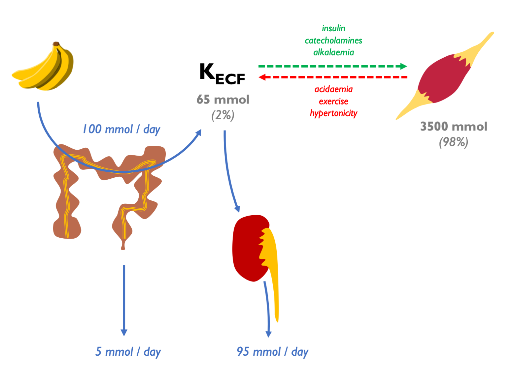

# (PART) Potassium {-}

# Potassium

98% of body K^+^ resides within cells:  

Extracellular potassium is regulated by parallel aldo-dependent and aldo-independent negative feedback loops, with K sensors in the adrenal cortex and DCT respectively:  

  

Therefore plasma [K^+^] is sensed at two points, the DCT and the *zona glomerulosa* of the adrenal gland.  In response to these inputs, the kidney responds by altering the balance between electroneutral (K-sparing) and electrogenic (K-wasting) Na^+^ reabsorption in the distal tubule:

## Quantification

Renal K^+^ excretion may be quantified in a 24 hr urine collection (as mmols / 24 hrs) or on a spot urine sample as:  

- U~K~ 
- U~K~:U~Cr~
- FE~K~
- TTKG (transtubular potassium gradient)  

Correlation between these measures is usually good.  In many cases, a 24 hr urine collection will give the most definitive result.  

FE~K~ usually 5 -- 15 % (can vary 2 -- 150 % in response to variations in K intake).

### Interpretation

In **hypokalaemia**, the following are indicative of *EXTRA-renal* loss:

+  24 hr UK \< 20 mmoles 
+  UK \< 20 mM 
+  UK:UCr \< 2.5 mmol/mmol
+  FEK \< 2 -- 3 % 
+  TTKG \< 2 

In **hypokalaemia**, the following are indicative of *RENAL* loss:

+  24 hr UK \> 20 mmoles 
+  UK \> 20 mM 
+  UK:UCr \> 2.5 mmol/mmol 
+  FEK \> 10 -- 15 % 
+  TTKG \>\> 3 

These  metrics were compared in a [Taiwanese cohort](https://pubmed.ncbi.nlm.nih.gov/15277290/) of patients with hypokalaemia and paralysis.  TTKG (with threshold ~ 3) and UK:UCr (threshold ~ 2.5 mmol/mmol) were able to neatly discriminate between HPP (i.e. non-renal cause) and non-HPP (predominantly renal causes = Gitelman and RTA).  Spot urine UK was not reliable: below 10 mM were all HPP; above 15 mM were all non-HPP but 10 -- 15 mM could be either.  

## TTKG {#TTKG}

The TTKG is used to estimate [K^+^] in the tubular fluid at the end of the CCD (i.e. the point where the tubular fluid was last isotonic to plasma). It accounts for water reabsorption in the MCD. Therefore it is a measure of renal K^+^ secretion -- and of mineralocorticoid bioactivity in the CCD.  

\BeginKnitrBlock{eqnpanel}
\begin{equation}
  \text{transtubular potassium gradient, } TTKG=\frac{(U_{K}/P_{K})}{(U_{Osm}/P_{Osm)}}=\frac{U_{K}\times P_{Osm}}{P_{K}\times {U_{Osm}}}
  (\#eq:TTKG)
\end{equation}
\EndKnitrBlock{eqnpanel}

### Assumptions & pre-requisites {-}

The validity of the TTKG as a measure of luminal [K^+^] in the CCD relies on a number of assumptions: 

i)  there is no K reabsorption or secretion in the MCD (valid except in profound K deficiency / XS)

ii) other solutes (Na / urea) are not secreted or reabsorbed in large amounts in the MCD

iii) the osmolality of the tubular fluid at the end of the CCD is similar to POsm

These assumptions are likely to be met if the following are true: 

i)  UNa \> 25 mM = 2 × maximal [Na^+^] required for ½-maximal K secretion in the distal rat nephron 

ii) UOsm \> 300 because vasopressin is required for optimal K secretion 

### Interpretation {-}

Summary [@choi2008; @ethier1990; @velazquez1993]:

+  on a normal diet, expect: TTKG = 8 -- 9 
+  on a high K diet (or in hyperkalaemia), expect: TTKG \> 10 
+  on a low K diet (or in hypokalaemia), expect: TTKG \< 3 

In hyperkalaemia:

+  TTKG \< 6 suggests impaired bioactivity of aldosterone in the ASDN 
+  TTKG \> 6 suggests non-renal cause *(e.g. K overload or ICF / ECF shifts)* 

TTKG \< 6 may be due to aldosterone deficiency or impaired renal response to aldosterone (e.g. trimethoprim inhibiting ENaC). The TTKG is perhaps most useful when used to distinguish between mineralocorticoid deficiency and mineralocorticoid resistance by looking for a change in TTKG after administering exogenous mineralocorticoid for a few days [@choi2008].

In hypokalaemia:

+  TTKG \> 3 suggests renal K losses 
+  TTKG \< 2 suggests extra-renal cause 
