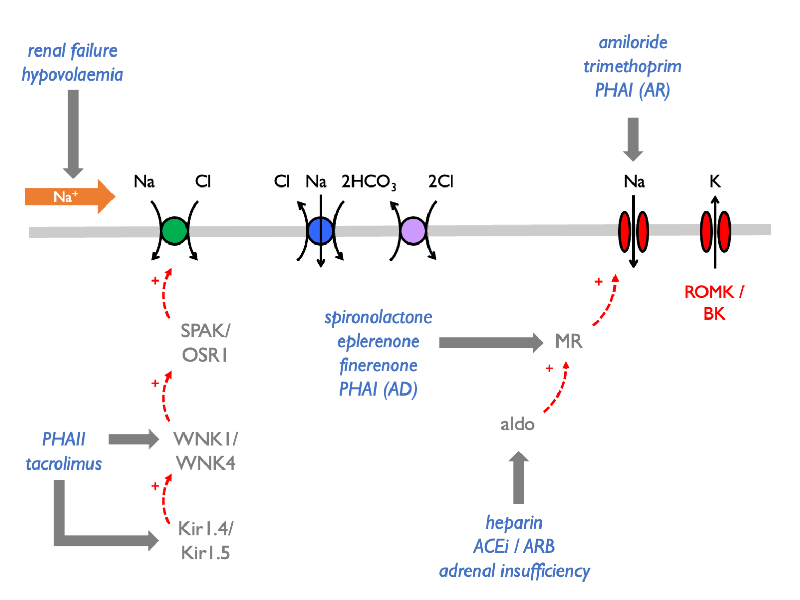

# Hyperkalaemia

## Causes of hyperkalaemia  

i)  spurious 
ii) distribution (ECF/ICF shifts) 
iii) impaired renal K^+^ excretion 

Renal excretion of K^+^ may be impaired if any of the following are limited [@hunter2019]: 

- GFR 
- tubular flow rate 
- delivery of Na^+^ to the distal nephron 
- aldosterone signalling in the distal nephron 

Hyperkalaemia is often due to an inappropriate shift from electrogenic to electroneutral Na^+^ reabsorption:  

Therefore the causes of hyperkalaemia are:  

<!-- - excessive potassium load  -->
<!--     - diet  -->
<!--     - IV penicillins   -->
<!-- - transcellular shifts  -->
<!--     - rhabdomyolysis, $\beta$-blockers, digoxin, anaestheic agents, mannitol   -->
<!-- - renal impairment (AKI / CKD)   -->
<!-- - defects in aldosterone signalling  -->
<!--     - impaired renin secretion (diabetes mellitus, $\beta$-blockers, NSAIDS)  -->
<!--     - impaired AngII signalling (ACEi, ARBs)  -->
<!--     - impaired aldosterone synthesis (Addisons's, heparins, ketoconazole)  -->
<!--     - impaired MR activaton (PHAI, spironolactone, eplerenone)   -->
<!-- - defects in electrogenic Na reabosorption  -->
<!--     - ENaC blockade (PHAI, amiloride, triamterene, trimethoprim, pentamidine, Li^+^)  -->
<!--     - NCC activation (PHAII, CNIs)   -->

<table>
<tbody>
  <tr>
   <td style="text-align:left;font-weight: bold;background-color: white !important;"> EXCESSIVE K LOAD </td>
   <td style="text-align:left;font-style: italic;background-color: white !important;"> diet </td>
   <td style="text-align:left;"> high-K diet </td>
  </tr>
  <tr>
   <td style="text-align:left;font-weight: bold;background-color: white !important;">  </td>
   <td style="text-align:left;font-style: italic;background-color: white !important;"> drugs </td>
   <td style="text-align:left;"> IV penicillin </td>
  </tr>
  <tr>
   <td style="text-align:left;font-weight: bold;background-color: white !important;"> TRANSCELLULAR SHIFTS </td>
   <td style="text-align:left;font-style: italic;background-color: white !important;"> cell injury </td>
   <td style="text-align:left;"> rhabdomyolysis </td>
  </tr>
  <tr>
   <td style="text-align:left;font-weight: bold;background-color: white !important;">  </td>
   <td style="text-align:left;font-style: italic;background-color: white !important;">  </td>
   <td style="text-align:left;"> beta-blockers </td>
  </tr>
  <tr>
   <td style="text-align:left;font-weight: bold;background-color: white !important;">  </td>
   <td style="text-align:left;font-style: italic;background-color: white !important;">  </td>
   <td style="text-align:left;"> digoxin </td>
  </tr>
  <tr>
   <td style="text-align:left;font-weight: bold;background-color: white !important;">  </td>
   <td style="text-align:left;font-style: italic;background-color: white !important;">  </td>
   <td style="text-align:left;"> anaesthetic agents </td>
  </tr>
  <tr>
   <td style="text-align:left;font-weight: bold;background-color: white !important;">  </td>
   <td style="text-align:left;font-style: italic;background-color: white !important;">  </td>
   <td style="text-align:left;"> mannitol </td>
  </tr>
  <tr>
   <td style="text-align:left;font-weight: bold;background-color: white !important;"> RENAL IMPAIRMENT </td>
   <td style="text-align:left;font-style: italic;background-color: white !important;"> renal impairment </td>
   <td style="text-align:left;"> AKI / CKD </td>
  </tr>
  <tr>
   <td style="text-align:left;font-weight: bold;background-color: white !important;"> DEFECTIVE ALDOSTERONE SIGNALLING </td>
   <td style="text-align:left;font-style: italic;background-color: white !important;"> impaired renin secretion </td>
   <td style="text-align:left;"> DM </td>
  </tr>
  <tr>
   <td style="text-align:left;font-weight: bold;background-color: white !important;">  </td>
   <td style="text-align:left;font-style: italic;background-color: white !important;">  </td>
   <td style="text-align:left;"> beta-blockers </td>
  </tr>
  <tr>
   <td style="text-align:left;font-weight: bold;background-color: white !important;">  </td>
   <td style="text-align:left;font-style: italic;background-color: white !important;">  </td>
   <td style="text-align:left;"> NSAIDS </td>
  </tr>
  <tr>
   <td style="text-align:left;font-weight: bold;background-color: white !important;">  </td>
   <td style="text-align:left;font-style: italic;background-color: white !important;">  </td>
   <td style="text-align:left;"> ACEi </td>
  </tr>
  <tr>
   <td style="text-align:left;font-weight: bold;background-color: white !important;">  </td>
   <td style="text-align:left;font-style: italic;background-color: white !important;">  </td>
   <td style="text-align:left;"> ARBs </td>
  </tr>
  <tr>
   <td style="text-align:left;font-weight: bold;background-color: white !important;">  </td>
   <td style="text-align:left;font-style: italic;background-color: white !important;">  </td>
   <td style="text-align:left;"> Addison's </td>
  </tr>
  <tr>
   <td style="text-align:left;font-weight: bold;background-color: white !important;">  </td>
   <td style="text-align:left;font-style: italic;background-color: white !important;">  </td>
   <td style="text-align:left;"> heparins </td>
  </tr>
  <tr>
   <td style="text-align:left;font-weight: bold;background-color: white !important;">  </td>
   <td style="text-align:left;font-style: italic;background-color: white !important;">  </td>
   <td style="text-align:left;"> ketoconazole </td>
  </tr>
  <tr>
   <td style="text-align:left;font-weight: bold;background-color: white !important;">  </td>
   <td style="text-align:left;font-style: italic;background-color: white !important;">  </td>
   <td style="text-align:left;"> PHAI </td>
  </tr>
  <tr>
   <td style="text-align:left;font-weight: bold;background-color: white !important;">  </td>
   <td style="text-align:left;font-style: italic;background-color: white !important;">  </td>
   <td style="text-align:left;"> spironolactone / eplerenone </td>
  </tr>
  <tr>
   <td style="text-align:left;font-weight: bold;background-color: white !important;"> DEFECTIVE ELECTROGENIC NA TRANSPORT </td>
   <td style="text-align:left;font-style: italic;background-color: white !important;"> ENaC blockade </td>
   <td style="text-align:left;"> PHAI </td>
  </tr>
  <tr>
   <td style="text-align:left;font-weight: bold;background-color: white !important;">  </td>
   <td style="text-align:left;font-style: italic;background-color: white !important;">  </td>
   <td style="text-align:left;"> amiloride / triamterine </td>
  </tr>
  <tr>
   <td style="text-align:left;font-weight: bold;background-color: white !important;">  </td>
   <td style="text-align:left;font-style: italic;background-color: white !important;">  </td>
   <td style="text-align:left;"> trimethoprim </td>
  </tr>
  <tr>
   <td style="text-align:left;font-weight: bold;background-color: white !important;">  </td>
   <td style="text-align:left;font-style: italic;background-color: white !important;">  </td>
   <td style="text-align:left;"> pentamidine </td>
  </tr>
  <tr>
   <td style="text-align:left;font-weight: bold;background-color: white !important;">  </td>
   <td style="text-align:left;font-style: italic;background-color: white !important;">  </td>
   <td style="text-align:left;"> lithium </td>
  </tr>
  <tr>
   <td style="text-align:left;font-weight: bold;background-color: white !important;">  </td>
   <td style="text-align:left;font-style: italic;background-color: white !important;">  </td>
   <td style="text-align:left;"> PHAII </td>
  </tr>
  <tr>
   <td style="text-align:left;font-weight: bold;background-color: white !important;">  </td>
   <td style="text-align:left;font-style: italic;background-color: white !important;">  </td>
   <td style="text-align:left;"> CNIs </td>
  </tr>
</tbody>
</table>

Use FECl response to thiazides as functional test for PHAII (normal response is < 3% increment).  

## Causes of spurious hyper- and hypokalaemia  

PseudohyperK from K-EDTA contamination.   

PseudohyperK due to prolonged delay prior to centrifugation *(blood cells leak K in cold weather)*.  

PseudohypoK due to prolonged delay prior to centrifugation *(blood cells take up K via Na-K-ATPase in the warm; "seasonal pseudohypoK" in summer)*.

PseudohyperK due to leucocytosis (WBC \> 70) -- *K released from cells during clot formation (test by measuring serum and plasma K simultaneously)*.

Familial hyperK due to abnormalities in RBC membrane permeability.
