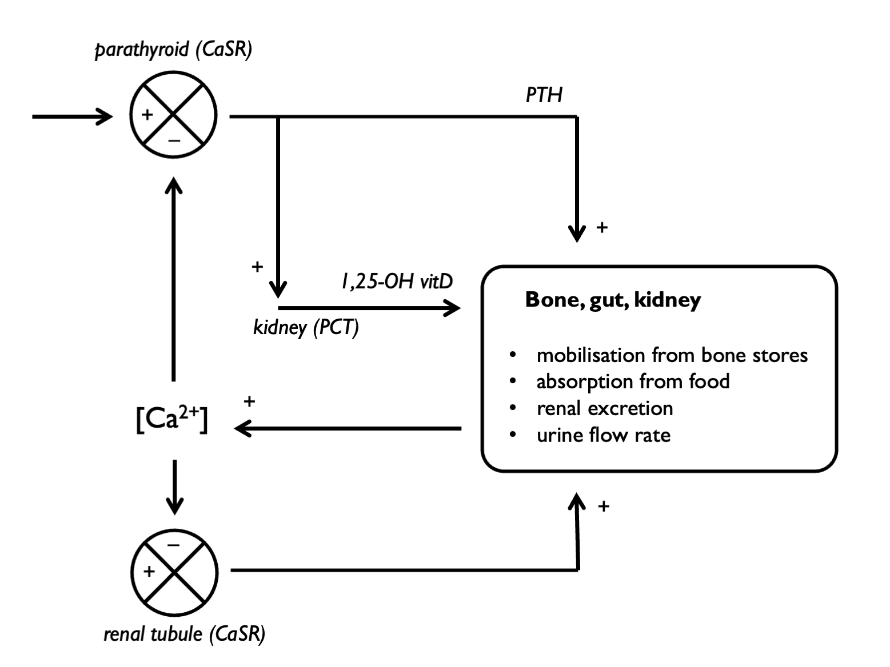
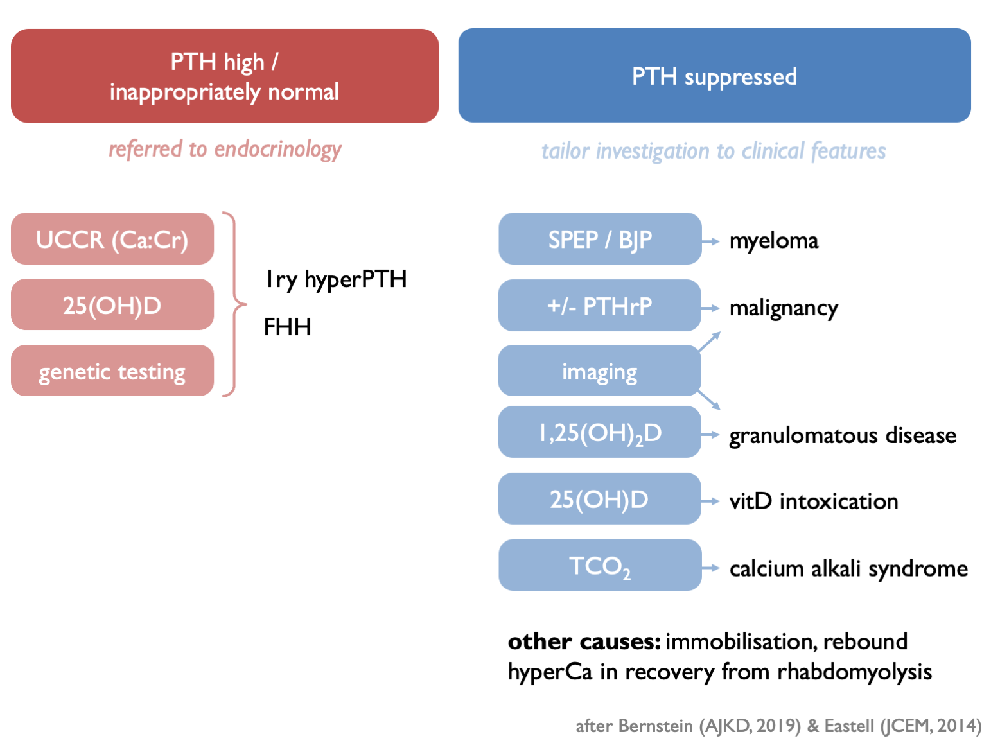

# Calcium

Serum calcium is regulated by PTH and vitamin D: 

 

Hypercalcaemia can be classified as PTH-dependent or PTH-independent:  

Drug causes of hypercalcaemia:  

<table>
<tbody>
  <tr>
   <td style="text-align:left;font-weight: bold;background-color: white !important;"> Mechanism </td>
   <td style="text-align:left;"> Drugs </td>
  </tr>
  <tr>
   <td style="text-align:left;font-weight: bold;background-color: white !important;"> Impaired urinary Ca2+ excretion </td>
   <td style="text-align:left;"> thiazide diuretics </td>
  </tr>
  <tr>
   <td style="text-align:left;font-weight: bold;background-color: white !important;">  </td>
   <td style="text-align:left;"> calcium-containing antacid preps (milk-alkali) </td>
  </tr>
  <tr>
   <td style="text-align:left;font-weight: bold;background-color: white !important;">  </td>
   <td style="text-align:left;"> lithium </td>
  </tr>
  <tr>
   <td style="text-align:left;font-weight: bold;background-color: white !important;"> Increased absorption </td>
   <td style="text-align:left;"> vitamin D preparations </td>
  </tr>
  <tr>
   <td style="text-align:left;font-weight: bold;background-color: white !important;">  </td>
   <td style="text-align:left;"> calcium-containing antacid preps (milk-alkali) </td>
  </tr>
  <tr>
   <td style="text-align:left;font-weight: bold;background-color: white !important;"> Stimulation of PTH secretion </td>
   <td style="text-align:left;"> lithium </td>
  </tr>
  <tr>
   <td style="text-align:left;font-weight: bold;background-color: white !important;"> Reduced bone buffering </td>
   <td style="text-align:left;"> vitamin A </td>
  </tr>
  <tr>
   <td style="text-align:left;font-weight: bold;background-color: white !important;">  </td>
   <td style="text-align:left;"> anti-oestrogens </td>
  </tr>
</tbody>
</table>

<!--  -->

## Investigations in hypercalcaemia:

## Urine calcium

Urine calcium excretion will vary according to calcium intake and urinary sodium excretion (with U~Ca~ and U~Na~ changing in parallel) [@foley2010].  There is also diurnal variation.  

Therefore urine calcium excretion is best assessed on 24 hr collection, rather than spot samples.  

Results may be expressed either as:  

- total calcium excretion (as mg per kg BW per day)  
- 24hr calcium-creatinine clearance ratio, CCCR  
- calcium / creatinine excretion ratio (as mg/mg or mmol/mmol)  

(The CCCR is often referred to as the FE~Ca~, but given the extent to which serum calcium is protein-bound, it may not be appropriate to think of it as such.)  

CCCR performs best as a screening test for familial hypocalciuric hypocalcaemia [@christensen2008].  

Random spot urine samples may be used (but are less accurate) and are normally interpreted as:  

- calcium / creatinine ratio (mg/mg or mmol/mmol)

## Interpreting the results   

### Unit conversions

Ca: 1 mg = 0.025 mmol
Cr: 1 mg = 0.0088 mmol

Therefore, a Ca/Cr of x mg/mg = 2.84x mmmol/mmol.  

### Normal calcium excretion:  

- 1--4 mg/kg/day (0.025--0.1 mmol/kg/day)
- Ca/Cr ratio < 0.14 mg/mg

### Hypercalciuria (e.g. in hyperPTH, other causes of hypercalcaemia, RTA):  

+ \>4 mg per kg per day
+ \>300 mg (= 7.50 mmol) per day (men) or >250 mg (= 6.25 mmol) per day (women)  
+ Ca/Cr ratio > 0.6 mmol/mmol = 0.20 mg/mg (adults) - or > 0.15 mg/mg in second void urine after an overnight fast    
+ FE~Ca~ > 2 % (CCCR > 0.020)

In an observational study of stone-formers (Curhan, KI 2001), stone risk elevated at thresholds lower than these classical cut-offs of 300 mg (M) or 250 mg (F) - but stone risk obviously complex and related to other urinary salts / pH etc.  

### Hypocalciuria (e.g. FHH, Gitelman):  

+ FE~Ca~ < 1 % (CCCR < 0.010)

In a small Japanese cohort of adult patients with Gitelman syndrome, calcium excretion was ~ 10-fold lower than in matched controls [@cheng2007a]:  

- 24hr excretion \~20 *vs* \~200 mg
- FE~Ca~ \~0.15% *vs* \~1.5%  
- Ca/Cr \~0.006 *vs* \~0.06 mg/mg (= \~0.02 *vs* \~0.2 mmol/mmol)  

