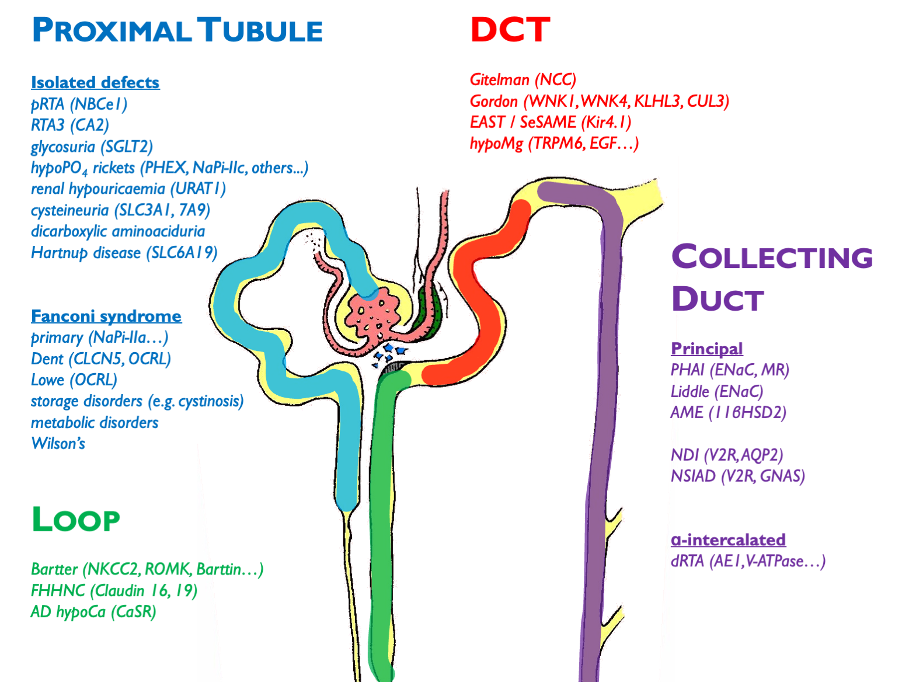
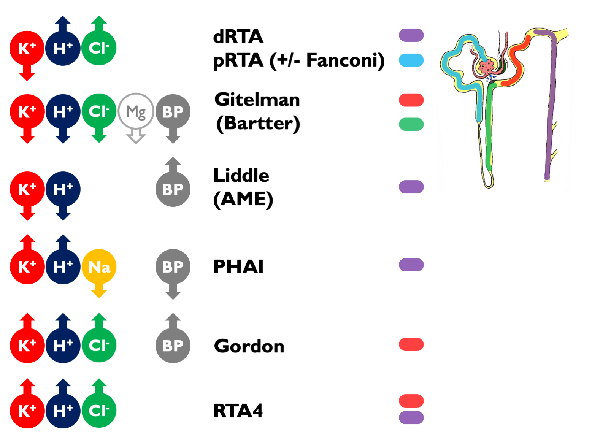
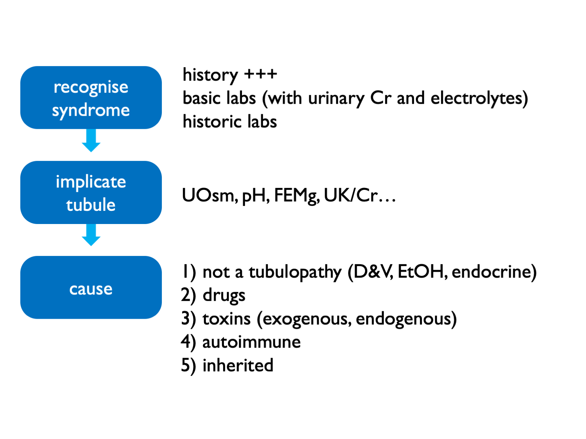

# (PART) Tubulopathies {-}

# Tubulopathies

## Inherited

Other disorders not depicted here (and not necessarily classified as a pure "tubulopathy'): 

- ADTKD (e.g. HNF1b etc.)  
- FHH (CaSR)  
- ciliopathies (ADPKD etc.)  
- metabolic disorders (oxalosis etc.)  
- endocrine disorders (GRA etc.)  

 
 

### Notes on some of the inherited tubulopathies

FHHNC = familial hypomagnesaemia with hypercalciuria and nephrocalcinosis

Inherited pRTA is very rare; inherited dRTA less so.  
Commonest cause of inherited Fanconi syndrome is cystinosis.  
XLD hypophosphataemic rickets is the commonest type; causes elevated FGF23 (phosphatonin).  

X-linked hypercalciuric nephrolithiasis = Dent’s disease, XLR nephrolithiasis, XLR hypophosphataemia rickets, LMWH proteinuria (all CLCn5 mutations).  Encodes chloride channel involved in endosomal acidification – therefore impaired endocytosis by megalin / cubulin.  Defective endocytosis of vitD and PTH lead to calciuria.  

 
 

## Acquired

Autoimmune associations with dRTA other than Sjogren are: SLE, PBC, AIH, thyroiditis.  

Can get dRTA mimic secondary to low UNa (e.g. cirrhosis, heart failure, nephrotic syndrome).  For complete list of 2ry causes see supplemental table 1 in [ESPN clinical practice points, NDT 2021](https://doi: 10.1093/ndt/gfab171).  

 
 

## Tubulopathy syndromes

Other tubulopathy phenotypes:

- NDI and SIAD
- nephrocalcinosis
- recurrent stone-formers
- CKD

 
 

### Interpretation of these electrolyte syndromes

Causes of hyperchloraemic acidosis:  

- diarrhoea / other lower GI losses (upH < 5.5)  
- RTA  
- ureteric diversion  
- iatrogenic chloride excess  

 

Fanconi = glucose, urate, phosphate, aa, LWMP (uPCR > 50 without uACR or RBP), vitD deficiency

Suspect incomplete dRTA if recurrent stones, nephrocalcinosis and borderline low or low-normal TCO2.  

NB can get a transient Fanconi-type syndrome (without glycosuria) in untreated dRTA.  

 
 

## Diagnostic approach in suspected tubulopathy

Exogenous toxins = heavy metals, AA (i.e. herbal preps)
Endogenous toxins = paraproteins

 
 

### Fractional excretions

- FECl <0.5% = not a salt-losing tubulopathy (and therefore purging instead) 
- FEMg >2 – 4% = renal wasting 
- FEPO4 >10 – 20% = renal wasting 

 
 

### Specialised testing

Rarely a role for more specialist testing:  

- urinary acidification test for recurrent stone-formers / nephrocalcinosis (NOT for frank acidosis) 
- thiazide test for Gitelman or Gordon (FECl) 
- urinary drug screen
- exome testing (available in Scotland for Bartter & Gitelman, Cystinuria, Nephrocalcinosis & Nephrolithiasis (large panel), PHA1 (paeds), tubulopathies and RTA panel (very large panel)

 
 

## Sjogren syndrome

Spectrum of kidney disease including (often overlapping):

- pure tubulopathies  
- tubuolocentric lymphocytic TIN (= "extraglandular epithelialitis")  
- IC MPGN of which 66% cryoglobulinaemia  
- cryoglobulinaemic vasculitis  

 
 

dRTA associated with Ro, La, hyperIg.  
NDI common but almost always well-compensated.  
GN associated with lymphoma.  

 
 

## Lithium-associated tubulopathy

Lithium causes:

- AVP-R (NDI)   
- (usually incomplete) dRTA  
- chronic TIN  
- podocytopathy   
- hyperCa (in 10% - can lead to parathyroid hyperplasia, therefore not easily reversible) 

 
 

### Pathogenesis

Renal toxicity largely explicable by effects in the distal tubule - but may have more pervasive effects on the rest of the renal tubule and the glomerulus.  

In [humans](https://pubmed.ncbi.nlm.nih.gov/10906157/) and [animals](https://pubmed.ncbi.nlm.nih.gov/3012187/), see chronic TIN with cortical and medullary cysts, predominantly arising from distal tubules (from Lectin stains).  High prevalence of FSGS and global GS.  

 

Chronic Li+ leads to down-regulation of AQP2 expression from:  
- direct reduction in APQ2 [mRNA](https://pubmed.ncbi.nlm.nih.gov/16495377/)  
- direct effects on AQP2 [lysosomal degradation](https://pubmed.ncbi.nlm.nih.gov/21881002/)  
- increased PGE2 production by medullary interstitial cells  
- GSK3b inhibition > beta-catenin > cell-cycle arrest  
- [growth-arrest](https://pubmed.ncbi.nlm.nih.gov/24408872/) of principle cells  

AQP2 activity controlled by exo- and endo-cytosis, regulated by phosphorylation and ubiquitination of C-terminus.  

 
 

### Polyuria

AVP-R in up to 40%.  May [persist long-term](https://pubmed.ncbi.nlm.nih.gov/848808/).  

Both AVP-D and primary polydipsia have been described in patients on chronic Li - therefore [may still require water deprivation test](https://www.uptodate.com/contents/renal-toxicity-of-lithium/).  Or perhaps copeptin test?  

Rx options:  

- low Na diet  
- amiloride (preferable if continuing Li) - evidence from 20 patients!  
- thiazide  
- NSAIDs (indomethacin)    
- dDAVP  
- viagra (AJP 2012, Am J Nephron 2015) 
- tamoxifen (AJP 2018)  

Must closely monitor Li+ levels if using diuretics (volume depletion > enhanced PCT reabsorption of Li+ > higher Li+ levels).  

 
 

### TIN

CKD from chronic TIN in up to 20%.  

Best data from [Lancet meta-analysis, 2012](https://pubmed.ncbi.nlm.nih.gov/22265699/) and [Swedish registry report, 2014](https://pubmed.ncbi.nlm.nih.gov/24503277/).  

eGFR c. 6 ml/min lower than matched controls.  

Big increase in RR of ESKD (c. 8x) but absolute risk of ESKD remains reasonably low.  Assuming ESKD risk of 0.1% in the general population, this would be around 0.8% on long-term Li+.  (Matches well with reported rate in Lancet meta-analysis: 0.5%.)  There are relatively few published data.  In the Swedish registry report, ESKD occurred in 15% of the Li+-taking population.  This may be due to the older age of these patients; in their age-restricted control population (over 55 yrs), there was an ESKD rate of 2%.  

Usually other classical RFs for CKD.  Mean duration of Li+ therapy before ESKD was 27 years.  

 
 

### Podocytopathy  

Minimal change nephropathy [has been described](https://www.uptodate.com/contents/renal-toxicity-of-lithium/).  Occurs within first few months of therapy and reversible on stopping Li+.  

FSGS and global GS classically considered to be secondary to the tubulopathy but this may be a direct effect (e.g. [foot process effacement common](https://pubmed.ncbi.nlm.nih.gov/10906157/)).  Good evidence for direct effect on podocyte homeostasis in [rodent and fly models](https://pubmed.ncbi.nlm.nih.gov/30679422/): inhibition of GSK3 results in podocyte apoptosis.   

 
 

## Salt-wasting tubulopathies

The inherited salt-wasting tubulopathies (Bartter and Gitleman syndromes) are characterised by profound salt-wasting with salt-craving and hypokalaemic alkalosis from secondary hyperaldosteronism.  

Gitelman commoner than Bartter. In adults, usually type 3 Bartter (overlap with Gitelman phenotype as ClC-Kb also expressed in DCT).

In **Bartter** syndrome, there is also:  

- [uncoupled tubuloglomerular feedback](https://pubmed.ncbi.nlm.nih.gov/33509356/) (in the absence of NaKCl uptake by MD cells, the MD behaves as if there is profound volume depletion, stimulating PGE~2~ and renin production - hence role for NSAIDs)  

- hypercalciuria and nephrocalcinosis  

- usually normal plasma Mg (except in some cases of type 3)  

 

In **Gitelman** syndrome, there is also:  

- hypocalciuria  
- hypomagnesaemia  
- chondrocalcinosis   
- [hypertension](https://pubmed-ncbi-nlm-nih-gov.eux.idm.oclc.org/23328711/) in adults (40 - 50%); renin elevated     

 

Adults can develop CKD and secondary FSGS (when RASi usually used - otherwise avoid).  

 

Liberal NaCl and K (+/- Mg) supplementation is required to target K \> 3 mM and Mg \> 0.6 mM.  Risk of dangerous hypoK during intercurrent vomiting / diarrhoea.  See [expert guidelines](https://pubmed.ncbi.nlm.nih.gov/33509356/).  

<!--

 
 

## Management
 
-->

<!-- 

### Supplements

- NEED TO DO: quantity of all supplements - uptodate?

- Slow K = KCl = start 2 tabs bd = less disgusting than SandoK  
- SlowNa = start 3 tabs tds and titrate up to 10 tabs tds = half daily losses in Gitelman  
- UroCitK = Kcitrate = start 2 tabs bd = crystals on wax tablet (appear in stool)  
- SMC approval for Sibnayal (K citrate + KHCO3 prolonged-release granules) = first licensed Rx for dRTA; better palatability in RCT  

NB K citrate improves bone health in healthy elderly!  

- MagTab SR = Mglactate = start 2 tabs bd  
- Organic Mg salts (aspartate or lactate) have better bioavailability than inorganic salts and therefore cause less diarrhoea  

 

Chronic hypoK probably okay; danger during intercurrent D&V.  

 
 

--> 

<!-- ### Salt-losing nephropathy   -->

<!-- Rx of **Gitleman** (see [KDIGO controversies](http://dx.doi.org/10.1016/j.kint.2016.09.046) and UKKA / RCA guidelines):   -->

<!-- - target K 3.0 mM and Mg 0.60 mM   -->
<!-- - use KCl, starting 40 mmol/day   -->
<!-- - not on an empty stomach; can give in water or syrup   -->
<!-- - inorganic Mg salts > low bioavailability > osmotic diarrhoea   -->
<!-- - organic salts (aspartate, citrate, lactate) better   -->
<!-- - start 300 mg (~12 mmol) per day as SR tabets, bd - qds with meals   -->
<!-- - only rarely amiloride / MRAs / indometacin   -->
<!-- - almost always avoid RASi (aggravate NaCl wasting) - unless 2ry FSGS   -->
<!-- - sick day rules (get bloods checked whenever unwell) - see supplemental table in KDIGO paper   -->
<!-- - elective surgery if K > 3 and Mg > 0.5   -->

