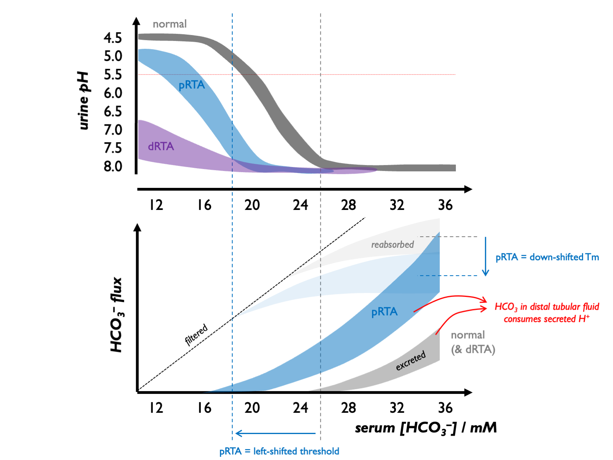

# Renal tubular acidosis

## Classification of RTA  

+  **type II (pRTA)** = impaired reabsorption of HCO~3~  

+  **type I (dRTA)** = inability to secrete H^+^: 
    +  complete = systemic acidosis  
    +  incomplete = no systemic acidosis  

+  **type IV** = hypoaldosteronism (+/- impaired ammoniagenesis from hyperK)

+  **type III (mixed)** =  CA inhibition  

+  **RTA in CKD**: 
    + HCMA when GFR \< 30 
    + WGMA when GFR \< 15  

 
 

### Pathogenesis of hypokalaemic RTA  

Normally, the tubular threshold for HCO3 is around 24 - 26 mM, so that plasma [HCO3] is maintained in that range.  

In dRTA, there is no change in the tubular threshold for HCO3 but due to a failure of distal acidification, urine pH never falls even in the face of systemic acidosis.  

In pRTA, there is a [reduction in the apparent Tm](https://www.kidneyfish.net/post/bicarbonaturia/) (and hence tubular threshold) for HCO3.  As a consequence, in mild systemic acidosis, there is renal bicarbonate wasting, maintaining an alkaline urine.  However, as the acidosis becomes more profound and [HCO3] drops below the tubular threshold, there is no tubular HCO3 loss and - because distal acidification remains intact - the urine can be acidified.  

(These mechanisms were established by [Edelman and colleagues](https://pubmed.ncbi.nlm.nih.gov/6059425/) in children with RTA in the late 1960s.)

Therefore:  

- in dRTA: urine pH is never low (always well above 5.5); a negative acid balance can never be achieved - hence the severe skeletal phenotype  

- in pRTA: urine pH may be alkaline or acid - depending on how profound the systemic acidosis is; negative acid balance can be achieved, avoiding a very severe skeletal phenotype    

 

Furthermore:  

- in dRTA: relatively modest HCO~3~ supplementation is required in dRTA (in the order of 1 mmol per kg per day to regenerate that lost to the buffering of non-volatile acid)  

- in pRTA: absolutely massive HCO~3~ supplementation - above 10 mmol per kg per day - would be required to drive systemic [HCO~3~] into the normal range; this might end up being counter-productive if the associated bicarbonaturia drives excessive K^+^ and Na^+^ loss  

 
 

### Pathogenesis of hyperkalaemic RTA

Two mechanisms account for type IV RTA:

i) reduced mineralocorticoid activity in the distal nephron, meaning that there is less electrogenic Na^+^ reabsorption (through ENaC) and a diminished electrical force driving H^+^ and K^+^ secretion; 

ii) hyperkalaemia *per se* impairs ammoniagenesis in the PCT  

 
 

### Associations

- dRTA CaP stones (alkaline urine, hypocitraturia, hypercalciuria)    
- nephrocalcinosis (in inherited forms particularly)    
- osteoporosis  

 
 

### Investigation of suspected RTA

+ see [investigation of HCMA](#IxHCMA)
+  UAG & FENaHCO~3~  
+  urine pH (never \< 5.5 in dRTA)  

+  in suspected pRTA 
    +  *tubular reabsorption of phosphate (TRP = 100 - FEPO~4~) \< 85 %* 
    +  *glycosuria, aminoaciduria, LMW proteinuria*  
    
+  in suspected dRTA 
    +  *furosemide-fludrocortisone (FF) test (failure to achieve pH \< 5.3 , 3 -- 4 hrs after 40 -- 80 mg / 1 mg)* 
    +  *UCa \> 4 mg / kg / day (or spot UCa/Cr \> 0.2) in type I RTA* 
    +  *USS / KUB (medullary nephrocalcinosis in type I RTA)* 
    +  *urinary citrate (low in type I RTA; high in type II / IV RTA)*  
    
+  kidney biopsy (to detect subclinical TIN)  
    
 

Test urinary RBP (retinol binding protein) as the most sensitive marker of proximal renal tubular dysfunction - good in sarcoid, Sjogren's etc.  Good for diagnosis and for tracking disease activity.  

 

USS more sensitive than CT for nephrocalcinosis in the context of hypoparathyroidism, but CT more specific (Boyce JCEM 2013).  Plain films very insensitive.  Therefore prefer USS for screening (but consider CT for verification).  

### Causes

<!-- +  pRTA (isolated)  -->
<!--     +  inherited  -->
<!--     +  acquired *topiramate*   -->

<!-- +  pRTA (with Fanconi)  -->
<!--     +  inherited *NBCe1A (AR with ocular abnormalities)*  -->
<!--     +  metabolic *Wilson's, cystinosis, fructose intolerance, Dent's, mitochondrial cytopathies*  -->
<!--     +  dysproteinaemia *myeloma, LCDD, LCFS is κ in 96 %, amyloid*  -->
<!--     +  tubulointerstitial *interstitial nephritis (inc. Sjogren's), allograft rejection*  -->
<!--     +  drugs *(Abx / cART)* *tenofovir, lamivudine, aminoglycosides, outdated tetracyclines*  -->
<!--     +  drugs *(other) cisplatin, valproate, lenalinomide*  -->
<!--     +  toxins *Pb, Hg, Cd, aristolochic acid*   -->

<!-- +  dRTA  -->
<!--     +  inherited *AEI (AR), H-ATPase B1 (AR with SNHL), H-ATPase A4 (AR)*  -->
<!--     +  tubulointerstitial *chronic pyelonephritis, chronic TIN, obstructive uropathy, sickle cell, rejection*  -->
<!--     +  autoimmune *hypergammaglobulinaemia, SLE, Sjogren's, chronic active hepatitis, PBC*  -->
<!--     +  drugs *Li^+^, amphoterecin, toluene*  -->
<!--     +  nephrocalcinosis *hyperPTH, idiopathic hypercalciuria, MSK*   -->

<!-- +  type IV  -->
<!--     +  low renin *DM, NSAIDs, CNIs, β--*  -->
<!--     +  high renin *Addisons, CAH, ACEi, ARB, heparin, ketoconazole*  -->
<!--     +  abnormal CD *TIN, spiro, amiloride, trimethoprim*   -->

<!-- +  type III  -->
<!--     +  inherited *CAII (AR with osteopetrosis / cerebral calcification)*  -->
<!--     +  acquired *topiramate (CA inhibition)*   -->

<table>
<tbody>
  <tr>
   <td style="text-align:left;font-weight: bold;background-color: white !important;"> PRTA (ISOLATED) </td>
   <td style="text-align:left;font-style: italic;background-color: white !important;"> inherited </td>
   <td style="text-align:left;"> inherited </td>
  </tr>
  <tr>
   <td style="text-align:left;font-weight: bold;background-color: white !important;">  </td>
   <td style="text-align:left;font-style: italic;background-color: white !important;"> acquired </td>
   <td style="text-align:left;"> topiramate </td>
  </tr>
  <tr>
   <td style="text-align:left;font-weight: bold;background-color: white !important;"> PRTA (WITH FANCONI) </td>
   <td style="text-align:left;font-style: italic;background-color: white !important;"> inherited </td>
   <td style="text-align:left;"> NBCe1A (AR with ocular abnormalities) </td>
  </tr>
  <tr>
   <td style="text-align:left;font-weight: bold;background-color: white !important;">  </td>
   <td style="text-align:left;font-style: italic;background-color: white !important;">  </td>
   <td style="text-align:left;"> Wilson's </td>
  </tr>
  <tr>
   <td style="text-align:left;font-weight: bold;background-color: white !important;">  </td>
   <td style="text-align:left;font-style: italic;background-color: white !important;">  </td>
   <td style="text-align:left;"> cystinosis </td>
  </tr>
  <tr>
   <td style="text-align:left;font-weight: bold;background-color: white !important;">  </td>
   <td style="text-align:left;font-style: italic;background-color: white !important;">  </td>
   <td style="text-align:left;"> fructose intolerance </td>
  </tr>
  <tr>
   <td style="text-align:left;font-weight: bold;background-color: white !important;">  </td>
   <td style="text-align:left;font-style: italic;background-color: white !important;">  </td>
   <td style="text-align:left;"> Dent disease </td>
  </tr>
  <tr>
   <td style="text-align:left;font-weight: bold;background-color: white !important;">  </td>
   <td style="text-align:left;font-style: italic;background-color: white !important;">  </td>
   <td style="text-align:left;"> mitochondrial cytopathies </td>
  </tr>
  <tr>
   <td style="text-align:left;font-weight: bold;background-color: white !important;">  </td>
   <td style="text-align:left;font-style: italic;background-color: white !important;">  </td>
   <td style="text-align:left;"> myeloma </td>
  </tr>
  <tr>
   <td style="text-align:left;font-weight: bold;background-color: white !important;">  </td>
   <td style="text-align:left;font-style: italic;background-color: white !important;">  </td>
   <td style="text-align:left;"> LCDD </td>
  </tr>
  <tr>
   <td style="text-align:left;font-weight: bold;background-color: white !important;">  </td>
   <td style="text-align:left;font-style: italic;background-color: white !important;">  </td>
   <td style="text-align:left;"> LCFS is κ in 96 %, </td>
  </tr>
  <tr>
   <td style="text-align:left;font-weight: bold;background-color: white !important;">  </td>
   <td style="text-align:left;font-style: italic;background-color: white !important;">  </td>
   <td style="text-align:left;"> amyloid </td>
  </tr>
  <tr>
   <td style="text-align:left;font-weight: bold;background-color: white !important;">  </td>
   <td style="text-align:left;font-style: italic;background-color: white !important;">  </td>
   <td style="text-align:left;"> Sjogren's </td>
  </tr>
  <tr>
   <td style="text-align:left;font-weight: bold;background-color: white !important;">  </td>
   <td style="text-align:left;font-style: italic;background-color: white !important;">  </td>
   <td style="text-align:left;"> other TIN </td>
  </tr>
  <tr>
   <td style="text-align:left;font-weight: bold;background-color: white !important;">  </td>
   <td style="text-align:left;font-style: italic;background-color: white !important;">  </td>
   <td style="text-align:left;"> allograft rejection </td>
  </tr>
  <tr>
   <td style="text-align:left;font-weight: bold;background-color: white !important;">  </td>
   <td style="text-align:left;font-style: italic;background-color: white !important;">  </td>
   <td style="text-align:left;"> tenofovir </td>
  </tr>
  <tr>
   <td style="text-align:left;font-weight: bold;background-color: white !important;">  </td>
   <td style="text-align:left;font-style: italic;background-color: white !important;">  </td>
   <td style="text-align:left;"> lamivudine </td>
  </tr>
  <tr>
   <td style="text-align:left;font-weight: bold;background-color: white !important;">  </td>
   <td style="text-align:left;font-style: italic;background-color: white !important;">  </td>
   <td style="text-align:left;"> aminoglycosides </td>
  </tr>
  <tr>
   <td style="text-align:left;font-weight: bold;background-color: white !important;">  </td>
   <td style="text-align:left;font-style: italic;background-color: white !important;">  </td>
   <td style="text-align:left;"> outdated tetracyclines </td>
  </tr>
  <tr>
   <td style="text-align:left;font-weight: bold;background-color: white !important;">  </td>
   <td style="text-align:left;font-style: italic;background-color: white !important;">  </td>
   <td style="text-align:left;"> cisplatin </td>
  </tr>
  <tr>
   <td style="text-align:left;font-weight: bold;background-color: white !important;">  </td>
   <td style="text-align:left;font-style: italic;background-color: white !important;">  </td>
   <td style="text-align:left;"> valproate </td>
  </tr>
  <tr>
   <td style="text-align:left;font-weight: bold;background-color: white !important;">  </td>
   <td style="text-align:left;font-style: italic;background-color: white !important;">  </td>
   <td style="text-align:left;"> lenalinomide </td>
  </tr>
  <tr>
   <td style="text-align:left;font-weight: bold;background-color: white !important;">  </td>
   <td style="text-align:left;font-style: italic;background-color: white !important;">  </td>
   <td style="text-align:left;"> Pb </td>
  </tr>
  <tr>
   <td style="text-align:left;font-weight: bold;background-color: white !important;">  </td>
   <td style="text-align:left;font-style: italic;background-color: white !important;">  </td>
   <td style="text-align:left;"> Hg </td>
  </tr>
  <tr>
   <td style="text-align:left;font-weight: bold;background-color: white !important;">  </td>
   <td style="text-align:left;font-style: italic;background-color: white !important;">  </td>
   <td style="text-align:left;"> Cd </td>
  </tr>
  <tr>
   <td style="text-align:left;font-weight: bold;background-color: white !important;">  </td>
   <td style="text-align:left;font-style: italic;background-color: white !important;">  </td>
   <td style="text-align:left;"> aristolochic acid </td>
  </tr>
  <tr>
   <td style="text-align:left;font-weight: bold;background-color: white !important;"> DRTA </td>
   <td style="text-align:left;font-style: italic;background-color: white !important;"> inherited </td>
   <td style="text-align:left;"> AEI (AR) </td>
  </tr>
  <tr>
   <td style="text-align:left;font-weight: bold;background-color: white !important;">  </td>
   <td style="text-align:left;font-style: italic;background-color: white !important;">  </td>
   <td style="text-align:left;"> H-ATPase B1 (AR with SNHL) </td>
  </tr>
  <tr>
   <td style="text-align:left;font-weight: bold;background-color: white !important;">  </td>
   <td style="text-align:left;font-style: italic;background-color: white !important;">  </td>
   <td style="text-align:left;"> H-ATPase A4 (AR) </td>
  </tr>
  <tr>
   <td style="text-align:left;font-weight: bold;background-color: white !important;">  </td>
   <td style="text-align:left;font-style: italic;background-color: white !important;">  </td>
   <td style="text-align:left;"> chronic pyelonephritis </td>
  </tr>
  <tr>
   <td style="text-align:left;font-weight: bold;background-color: white !important;">  </td>
   <td style="text-align:left;font-style: italic;background-color: white !important;">  </td>
   <td style="text-align:left;"> chronic TIN </td>
  </tr>
  <tr>
   <td style="text-align:left;font-weight: bold;background-color: white !important;">  </td>
   <td style="text-align:left;font-style: italic;background-color: white !important;">  </td>
   <td style="text-align:left;"> obstructive uropathy </td>
  </tr>
  <tr>
   <td style="text-align:left;font-weight: bold;background-color: white !important;">  </td>
   <td style="text-align:left;font-style: italic;background-color: white !important;">  </td>
   <td style="text-align:left;"> sickle cell </td>
  </tr>
  <tr>
   <td style="text-align:left;font-weight: bold;background-color: white !important;">  </td>
   <td style="text-align:left;font-style: italic;background-color: white !important;">  </td>
   <td style="text-align:left;"> allograft rejection </td>
  </tr>
  <tr>
   <td style="text-align:left;font-weight: bold;background-color: white !important;">  </td>
   <td style="text-align:left;font-style: italic;background-color: white !important;">  </td>
   <td style="text-align:left;"> hypergammaglobulinaemia </td>
  </tr>
  <tr>
   <td style="text-align:left;font-weight: bold;background-color: white !important;">  </td>
   <td style="text-align:left;font-style: italic;background-color: white !important;">  </td>
   <td style="text-align:left;"> SLE </td>
  </tr>
  <tr>
   <td style="text-align:left;font-weight: bold;background-color: white !important;">  </td>
   <td style="text-align:left;font-style: italic;background-color: white !important;">  </td>
   <td style="text-align:left;"> Sjogren's </td>
  </tr>
  <tr>
   <td style="text-align:left;font-weight: bold;background-color: white !important;">  </td>
   <td style="text-align:left;font-style: italic;background-color: white !important;">  </td>
   <td style="text-align:left;"> chronic active hepatitis </td>
  </tr>
  <tr>
   <td style="text-align:left;font-weight: bold;background-color: white !important;">  </td>
   <td style="text-align:left;font-style: italic;background-color: white !important;">  </td>
   <td style="text-align:left;"> PBC </td>
  </tr>
  <tr>
   <td style="text-align:left;font-weight: bold;background-color: white !important;">  </td>
   <td style="text-align:left;font-style: italic;background-color: white !important;">  </td>
   <td style="text-align:left;"> Li+ </td>
  </tr>
  <tr>
   <td style="text-align:left;font-weight: bold;background-color: white !important;">  </td>
   <td style="text-align:left;font-style: italic;background-color: white !important;">  </td>
   <td style="text-align:left;"> amphoterocin </td>
  </tr>
  <tr>
   <td style="text-align:left;font-weight: bold;background-color: white !important;">  </td>
   <td style="text-align:left;font-style: italic;background-color: white !important;">  </td>
   <td style="text-align:left;"> toluene </td>
  </tr>
  <tr>
   <td style="text-align:left;font-weight: bold;background-color: white !important;">  </td>
   <td style="text-align:left;font-style: italic;background-color: white !important;">  </td>
   <td style="text-align:left;"> hyperPTH </td>
  </tr>
  <tr>
   <td style="text-align:left;font-weight: bold;background-color: white !important;">  </td>
   <td style="text-align:left;font-style: italic;background-color: white !important;">  </td>
   <td style="text-align:left;"> idiopathic hypercalciuria </td>
  </tr>
  <tr>
   <td style="text-align:left;font-weight: bold;background-color: white !important;">  </td>
   <td style="text-align:left;font-style: italic;background-color: white !important;">  </td>
   <td style="text-align:left;"> MSK </td>
  </tr>
  <tr>
   <td style="text-align:left;font-weight: bold;background-color: white !important;"> TYPE IV </td>
   <td style="text-align:left;font-style: italic;background-color: white !important;"> low renin </td>
   <td style="text-align:left;"> DM </td>
  </tr>
  <tr>
   <td style="text-align:left;font-weight: bold;background-color: white !important;">  </td>
   <td style="text-align:left;font-style: italic;background-color: white !important;">  </td>
   <td style="text-align:left;"> NSAIDs </td>
  </tr>
  <tr>
   <td style="text-align:left;font-weight: bold;background-color: white !important;">  </td>
   <td style="text-align:left;font-style: italic;background-color: white !important;">  </td>
   <td style="text-align:left;"> CNIs </td>
  </tr>
  <tr>
   <td style="text-align:left;font-weight: bold;background-color: white !important;">  </td>
   <td style="text-align:left;font-style: italic;background-color: white !important;">  </td>
   <td style="text-align:left;"> β– </td>
  </tr>
  <tr>
   <td style="text-align:left;font-weight: bold;background-color: white !important;">  </td>
   <td style="text-align:left;font-style: italic;background-color: white !important;">  </td>
   <td style="text-align:left;"> Addison's </td>
  </tr>
  <tr>
   <td style="text-align:left;font-weight: bold;background-color: white !important;">  </td>
   <td style="text-align:left;font-style: italic;background-color: white !important;">  </td>
   <td style="text-align:left;"> CAH </td>
  </tr>
  <tr>
   <td style="text-align:left;font-weight: bold;background-color: white !important;">  </td>
   <td style="text-align:left;font-style: italic;background-color: white !important;">  </td>
   <td style="text-align:left;"> ACEi / ARB </td>
  </tr>
  <tr>
   <td style="text-align:left;font-weight: bold;background-color: white !important;">  </td>
   <td style="text-align:left;font-style: italic;background-color: white !important;">  </td>
   <td style="text-align:left;"> heparin </td>
  </tr>
  <tr>
   <td style="text-align:left;font-weight: bold;background-color: white !important;">  </td>
   <td style="text-align:left;font-style: italic;background-color: white !important;">  </td>
   <td style="text-align:left;"> ketoconazole </td>
  </tr>
  <tr>
   <td style="text-align:left;font-weight: bold;background-color: white !important;">  </td>
   <td style="text-align:left;font-style: italic;background-color: white !important;">  </td>
   <td style="text-align:left;"> TIN </td>
  </tr>
  <tr>
   <td style="text-align:left;font-weight: bold;background-color: white !important;">  </td>
   <td style="text-align:left;font-style: italic;background-color: white !important;">  </td>
   <td style="text-align:left;"> sprionolactone / amiloride </td>
  </tr>
  <tr>
   <td style="text-align:left;font-weight: bold;background-color: white !important;">  </td>
   <td style="text-align:left;font-style: italic;background-color: white !important;">  </td>
   <td style="text-align:left;"> trimethoprim </td>
  </tr>
  <tr>
   <td style="text-align:left;font-weight: bold;background-color: white !important;"> TYPE III </td>
   <td style="text-align:left;font-style: italic;background-color: white !important;"> inherited </td>
   <td style="text-align:left;"> CAII (AR with osteopetrosis / cerebral calcification) </td>
  </tr>
  <tr>
   <td style="text-align:left;font-weight: bold;background-color: white !important;">  </td>
   <td style="text-align:left;font-style: italic;background-color: white !important;">  </td>
   <td style="text-align:left;"> topiramate (CA inhibition) </td>
  </tr>
</tbody>
</table>

 

Sjogrens classically causes a dRTA (but can also cause pRTA if interstitial nephritis).  Autoimmune dRTA is Sjogrens in 80 - 90%.  Subclinical tubular involvment in 30% Sjorens.  Often associated with hypocitruria and low-grade features of Fanconi syndrome.  Treat CIN with MMF or pred / RTX.  Treat dRTA with K citrate.  Autoantibodies to H+-ATPase or bicarb exchanger.  

 

Mitochondrial cytopathy: raised CK, abnormal number of microchondria (EM).

<!-- ### Treatment -->

<!-- +  K citrate  -->
<!-- +  +/- NaHCO~3~  -->

## Fanconi syndrome

In adults, usually acquired:

- tenfovir and other drugs (antivirals, fumaderm for Psoriasis)  
- heavy metals  
- LCCD  
- post-Tx  

Check for:

- LMWH proteinuria (e.g. retinol binding protein; high uPCR with a negative dip)  
- uricosuria  
- phosphaturia  
- renal glycosuria  

LMW proteinuria is the most sensitive test (because megalin is the most energy-sensitive process and therefore most vulnerable to becoming disrupted).  Glycosuria appears last (least energy-sensitive process).    

<!--   -->
<!--   -->

<!-- ## Management -->

<!-- **Alkali supplements** for RTA (see [ESPN clinical practice points, NDT 2021](https://doi: 10.1093/ndt/gfab171)):   -->

<!-- - citrate unpalatable; longer half-life (as requires hepatic metabolism), more concentrated (2 - 3 mmmol/ml)   -->
<!-- - HCO3 associated with belching; less concentrated (1 mmol/ml)   -->
<!-- - microgranular formulation of K citrate and KHCO3 since 2017   -->
<!-- - usually 2 - 3 mmol/kg/day in adults (target HCO3, Cl, K and UCa); start at 60 mmol/day   -->
<!-- - may need additional KCl   -->
<!-- - avoid thaizides (will aggravate hypoK)   -->
<!-- - should have surveillance USS   -->

<!--   -->

<!-- Uptodate:   -->

<!-- - see table 1 for options of alkali therapy   -->
<!-- - dRTA = start 80 - 120 mmol citrate (or HCO3) per day; usual maintenance 30 - 50 (or 1 - 2 mmol/kg/day)   -->
<!-- - pRTA needs much higher doses because therapeutic HCO3 load will exceed Tm and cause a bicarbonate diureis - therefore need 10 -- 15 mmmol/kg/day - may aggravate hypoK - so may need liquid sodium citrate as most concentrated   -->
<!-- - may need thiazides (to limit HCO3 wasting) / amiloride (to limit hypoK) in pRTA   -->
